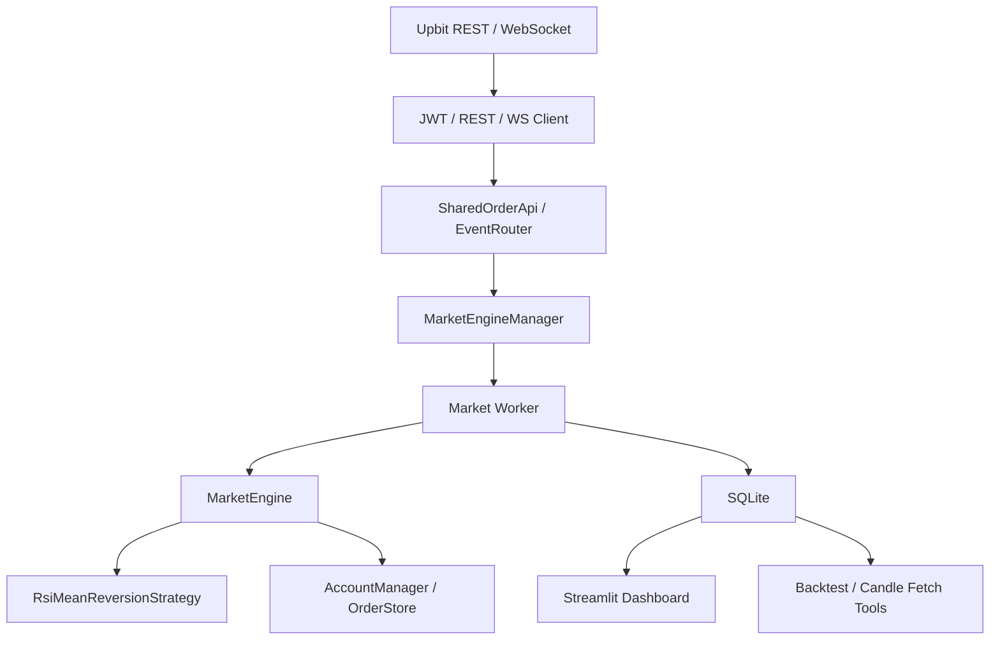
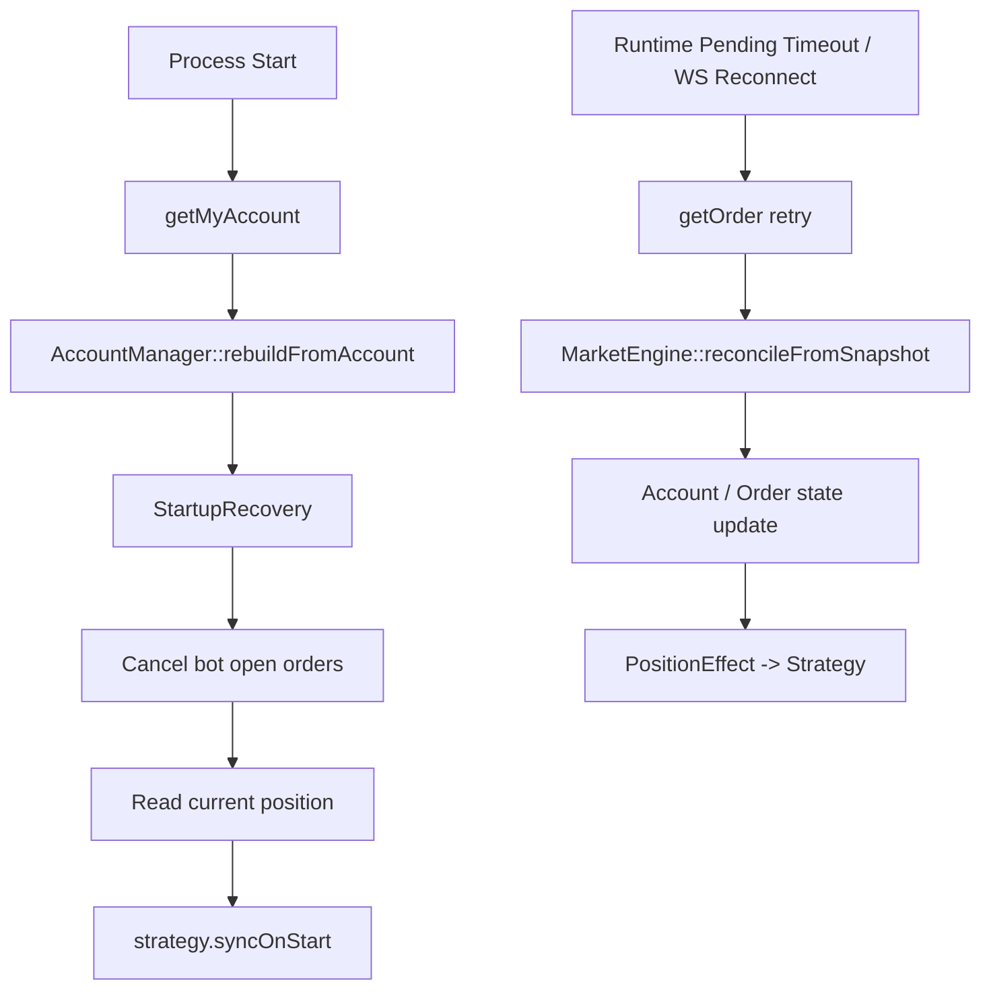

# CoinBot


Upbit REST/WebSocket과 직접 연결되는 C++20 기반 멀티마켓 자동매매 시스템입니다.  
여러 마켓을 동시에 처리하면서도 각 마켓 상태는 단일 워커 스레드에 고정해 동시성 복잡도를 줄였습니다.  
주문 제출 전 KRW를 RAII 토큰으로 예약하고, 주문 상태와 포지션 효과를 분리해 부분 체결과 이벤트 유실 상황에서도 상태 전이를 안정화했습니다.  
재시작 시에는 봇의 미체결 주문을 취소하고 포지션만 복구하며, 런타임에서는 pending timeout과 WS 재연결 뒤 `getOrder()` 기반 복구를 수행합니다.  
실거래 데이터는 SQLite WAL에 적재되고, Streamlit 대시보드와 Python 도구가 같은 데이터를 기반으로 분석과 백테스트를 수행합니다.

## 내가 해결한 문제

- 실시간 public/private WebSocket 이벤트를 함께 처리하면서도, 마켓별 상태는 순차적으로 다루는 구조가 필요했습니다.
- 주문 제출, 부분 체결, 취소, WS 유실, 재연결 같은 상황에서도 자금 정합성이 무너지지 않아야 했습니다.
- 봇 실행 자체에서 끝나지 않고, 실거래 데이터를 누적해 운영 분석과 전략 검증까지 이어지는 흐름이 필요했습니다.

## 핵심 설계 포인트

- **Exchange Integration Layer**: `UpbitJwtSigner -> RestClient -> UpbitExchangeRestClient -> SharedOrderApi`로 외부 거래소 연동을 분리했습니다.
- **Market-Per-Worker Concurrency**: `MarketEngineManager`가 마켓당 하나의 `std::jthread`를 소유하고, `EventRouter -> BlockingQueue -> worker` 흐름으로 입력을 분배합니다.
- **RAII ReservationToken**: 매수 전 KRW를 예약하고, 주문 실패/취소 시 자동 반환되도록 자금 흐름을 토큰 수명과 연결했습니다.
- **PositionEffect 기반 상태 전이**: `Filled/Canceled` 같은 거래소 상태 이름과 실제 포지션 변화를 분리해 전략 상태를 더 안전하게 확정합니다.
- **Recovery + Persistence**: 시작 복구, 런타임 복구, SQLite WAL 기록, Streamlit/백테스트 도구를 하나의 운영 흐름으로 연결했습니다.

## 프로젝트 결과

- 기본 설정 기준 `KRW-ADA`, `KRW-ETH`, `KRW-XRP` 3개 마켓 예시를 동시에 처리하며, 마켓 목록은 `UPBIT_MARKETS`로 변경할 수 있습니다.
- public 캔들 스트림과 private `myOrder` 스트림을 분리 처리하고, private WS에는 30초 텍스트 heartbeat를 넣어 idle EOF를 방지했습니다.
- pending 주문은 timeout과 재연결 시점에 `getOrder()` 기반으로 복구하며, 봇 재시작 시에는 이전 봇 주문을 취소하고 포지션만 이어받습니다.
- 실거래 데이터는 `candles`, `orders`, `signals` 테이블에 기록되며, SQLite WAL 모드로 봇 쓰기와 분석 읽기를 병행합니다.
- `streamlit/app.py`, `tools/fetch_candles.py`, `tools/candle_rsi_backtest.py`를 통해 실거래 분석, 과거 데이터 적재, 전략 근사 백테스트까지 이어집니다.

## 시스템 범위

- **C++ Runtime**: 실시간 이벤트 수신, 전략 실행, 주문 제출, 주문/포지션 상태 관리
- **Persistence**: SQLite 기반 `candles`, `orders`, `signals` 적재
- **Analysis Tooling**: Streamlit 대시보드, 과거 캔들 수집기, RSI 백테스트 스크립트
- **Operations**: Linux `systemd` 서비스와 EC2 배포 스크립트

## 아키텍처

### Runtime Overview



### Recovery Flow



## 설계 상세

### 1. Exchange Integration Layer

이 프로젝트는 HTTP 서버가 아니라, **외부 거래소를 직접 호출하는 클라이언트 시스템**입니다.  
REST는 `UpbitJwtSigner`, `RestClient`, `UpbitExchangeRestClient`, `SharedOrderApi`로 나뉘며, 엔진 계층은 최종적으로 `IOrderApi` 인터페이스만 의존합니다.

이 구조 덕분에 거래소 세부 구현과 엔진 로직이 분리되고, 멀티마켓 환경에서도 하나의 REST 클라이언트를 직렬화해서 공유할 수 있습니다.

### 2. Concurrency Model

마켓 하나당 `MarketEngine`, 전략, 큐, 워커 스레드를 하나씩 두고, 각 마켓 상태는 그 워커만 수정합니다.  
즉 멀티마켓은 병렬이지만, **마켓 내부 상태는 단일 스레드 소유권**으로 단순화했습니다.

```cpp
ctx->worker = std::jthread([this, &ctx_ref = *ctx](std::stop_token stoken) {
    workerLoop_(ctx_ref, stoken);
});
```

입력은 `EventRouter`가 raw JSON에서 마켓만 추출해 `BlockingQueue`로 넘기고, 실제 파싱과 처리 책임은 마켓 워커가 집니다.  
이렇게 해서 IO 스레드 부하를 줄이면서도 마켓별 이벤트 순서를 보존했습니다.

### 3. ReservationToken 기반 자금 관리

매수 주문은 먼저 KRW를 예약한 뒤 제출합니다.  
예약은 `ReservationToken`이라는 move-only RAII 객체로 표현했고, 주문 실패나 취소로 토큰이 비활성화되지 못하면 소멸자 경로에서 자동 반환됩니다.

```cpp
auto token = account_mgr_.reserve(market_, reserve_amount);
active_buy_token_.emplace(std::move(*token));
```

이 방식으로 자금 부족, 중복 매수, 실패 후 잔액 누수 같은 문제를 줄였습니다.  
자금 모델은 `available_krw`, `reserved_krw`, `coin_balance`를 분리한 전량 거래 모델이며, pending 상태와 부분 체결 같은 중간 상태를 명시적으로 다룹니다.

### 4. PositionEffect 기반 상태 전이

거래소가 보내는 `Filled`, `Canceled`, `Rejected`는 주문 상태일 뿐, 그것만으로 실제 포지션이 열렸는지 닫혔는지를 항상 안전하게 알 수는 없습니다.  
이 프로젝트는 `PositionEffect::Opened`, `Reduced`, `Closed`를 별도로 계산해 전략에 전달합니다.

핵심은 **주문 상태 이름과 포지션 변화 효과를 분리했다는 점**입니다.  
이 덕분에 부분 체결 후 취소, WS 체결 유실, snapshot 기반 복구 상황에서도 전략 상태를 더 일관되게 유지할 수 있습니다.

### 5. Recovery and Operational Resilience

복구는 시작 시점과 런타임 시점을 분리했습니다.

- **시작 복구**: 봇이 이전에 낸 미체결 주문을 취소하고, 현재 계좌의 포지션만 읽어 전략 상태를 복구합니다.
- **런타임 복구**: pending timeout 또는 private WS 재연결 후 `getOrder()` 재시도로 주문 상태를 다시 확인하고, `reconcileFromSnapshot()`으로 delta를 정산합니다.

치명 상태는 프로세스를 살려 두기보다 `exit(1)`로 종료하고, Linux 운영 환경에서는 `systemd Restart=on-failure`가 재시작을 담당합니다.

### 6. Persistence and Analysis Pipeline

봇은 실시간 실행에서 끝나지 않고, 거래 데이터를 SQLite에 남깁니다.

- `candles`: 캔들 저장
- `orders`: 터미널 주문 이력 저장
- `signals`: 전략 관점의 BUY/SELL 신호 저장

SQLite는 `WAL` 모드로 열어 봇 쓰기와 Streamlit 읽기가 서로 덜 막히도록 했습니다.  
이 데이터는 Streamlit 대시보드의 P&L/전략 분석, 과거 캔들 적재, RSI 백테스트로 이어집니다.

## 전략

현재 기본 전략은 **RSI Mean Reversion**입니다.

- RSI 과매도 구간에서 진입
- RSI 과매수 구간에서 청산
- 변동성 필터와 trend strength 필터로 평균회귀가 부적합한 구간을 제외
- `onIntrabarCandle()`에서 손절/익절 가격을 실시간 체크
- 확정봉에서는 RSI 기반 청산을 평가

즉 이 프로젝트의 전략은 단순 지표 계산보다, **실시간 이벤트와 주문 상태 변화에 전략 상태를 연결하는 방식**에 더 초점이 있습니다.

## 도구와 운영

### Streamlit Dashboard

`streamlit/app.py`는 SQLite에 저장된 실거래 데이터를 기반으로 아래 기능을 제공합니다.

- P&L 분석
- 전략 신호와 캔들 차트 시각화
- RSI/청산 사유 분석
- 백테스트 결과와 실거래 신호 비교

### Python Tools

- `tools/fetch_candles.py`: 과거 캔들을 DB에 적재
- `tools/candle_rsi_backtest.py`: C++ 전략 파라미터와 정렬된 근사 백테스트 수행

### Deployment

`deploy/coinbot.service`와 `deploy/deploy.sh`를 통해 Linux 운영 환경에 배포할 수 있습니다.

- `Restart=on-failure` 기반 자동 재시작
- `WorkingDirectory=/home/ubuntu/coinbot`
- mountpoint / sentinel 파일 검증으로 잘못된 디스크 배포 방지

## Build / Run

### Windows Development

Windows는 Visual Studio 2022 + MSVC + CMake preset 기준입니다.

- `CMakePresets.json`의 Windows preset은 로컬 Boost/OpenSSL/nlohmann 경로를 전제로 합니다.
- 개발용 preset: `x64-debug`, `x64-release`
- 편의 스크립트: `build_and_check.cmd`

### Local Linux / WSL

```bash
cmake --preset linux-release
cmake --build out/build/linux-release -j$(nproc)
cp .env.local.example .env.local
bash scripts/run_local.sh
```

필수 환경 변수는 아래 3개입니다.

- `UPBIT_ACCESS_KEY`
- `UPBIT_SECRET_KEY`
- `UPBIT_MARKETS`

### Streamlit / Tools

먼저 봇을 한 번 실행해 `db/coinbot.db`가 생성되어 있어야 합니다.

```bash
pip install -r streamlit/requirements.txt
streamlit run streamlit/app.py
```

```bash
pip install -r tools/requirements.txt
python tools/fetch_candles.py --days 90 --unit 15
python tools/candle_rsi_backtest.py --market KRW-XRP --days 30
```

## 저장소 구조

```text
src/
  core/        # 도메인 타입, BlockingQueue
  util/        # Config, Logger
  api/         # JWT, REST, WebSocket, Upbit DTO/Mapper
  trading/     # 전략, 지표, 자금 관리
  engine/      # MarketEngine, OrderStore, 엔진 이벤트
  app/         # CoinBot, MarketEngineManager, EventRouter, StartupRecovery
  database/    # SQLite 래퍼와 스키마

streamlit/
  app.py       # 분석 대시보드

tools/
  fetch_candles.py
  candle_rsi_backtest.py

deploy/
  coinbot.service
  deploy.sh
```

## Trade-offs / Known Limits

- 이벤트 큐는 bounded queue + `drop-oldest` 정책이라, 극단적 포화 상황에서는 유실 가능성이 있습니다.
- graceful shutdown은 아직 완전하지 않아 종료 직전 pending 주문 정합성 보장은 제한적입니다.
- 백테스트는 실전 엔진의 근사 모델이며, 체결가와 슬리피지 처리에 단순화가 있습니다.
- 봇 외부 수동 거래와 로컬 상태가 어긋날 수 있으므로, 기본 전제는 봇 단독 계좌 사용입니다.

## 문서

- [docs/EC2_DEPLOY.md](docs/EC2_DEPLOY.md)
- [docs/IMPLEMENTATION_STATUS.md](docs/IMPLEMENTATION_STATUS.md)
- [docs/PROJECT_FLOWSRUDY.md](docs/PROJECT_FLOWSRUDY.md)
- [docs/review.md](docs/review.md)

## 한 줄 요약

CoinBot은 단순한 RSI 자동매매 예제가 아니라, **C++로 구현한 실시간 이벤트 처리, 상태 복구, 자금 정합성 관리, 분석 파이프라인까지 포함한 멀티마켓 트레이딩 시스템**입니다.
