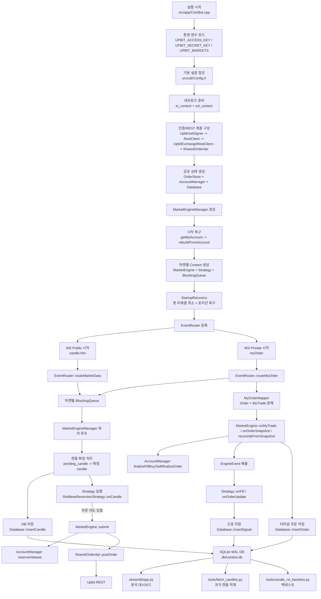

# CoinBot 프로젝트 흐름 학습 문서

## 문서 목적

이 문서는 현재 CoinBot이 실제로 어떻게 시작되고, 어떤 파일들이 어떤 순서로 연결되며, 캔들 수신부터 주문 발행과 DB 기록까지 흐름이 어떻게 이어지는지 학습용으로 정리한 문서다.

핵심만 먼저 말하면 이 프로젝트는 아래 3축으로 나뉜다.

- C++ 실거래 봇: `src/app/CoinBot.cpp`에서 시작해서 업비트 REST/WS와 연결되고, 전략과 주문 엔진을 돌린다.
- SQLite 기반 데이터 축: 봇은 `candles`, `orders`, `signals`를 `db/coinbot.db`에 적재한다.
- Python 분석/운영 축: `streamlit/app.py`, `tools/fetch_candles.py`, `tools/candle_rsi_backtest.py`가 이 DB를 읽거나 채운다.

---

## 1. 프로젝트의 진짜 시작점

### 1-1. 실행 엔트리 포인트는 `src/app/CoinBot.cpp`

실행은 `main()`에서 시작한다. 이 파일이 전체 조립자 역할을 한다.

`main()`이 먼저 하는 일은 다음과 같다.

- `SIGINT`, `SIGTERM` 시그널 핸들러 등록
- `UPBIT_ACCESS_KEY`, `UPBIT_SECRET_KEY` 환경 변수 읽기
- `UPBIT_MARKETS`가 있으면 CSV로 마켓 목록 읽기, 없으면 `src/util/Config.h`의 기본 마켓 사용
- 모든 준비가 끝나면 `run(access_key, secret_key, markets)` 호출

즉, 이 프로젝트를 읽을 때 첫 번째로 봐야 할 파일은 무조건 `src/app/CoinBot.cpp`다. 이 파일 안에 전체 초기화 순서가 주석으로도 잘 적혀 있다.

### 1-2. 외부 설정의 실제 출처는 `src/util/Config.h`

현재 이 프로젝트는 별도의 JSON/YAML 설정 파일을 읽지 않는다. `util::AppConfig::instance()` 싱글톤의 기본값을 그대로 사용한다.

여기서 중요한 기본값은 다음과 같다.

- `bot.markets`: 기본 거래 마켓 목록
- `bot.live_candle_unit_minutes`: 실시간 WS에서 구독할 분봉 단위
- `bot.db_path`: 기본 DB 경로, 기본값은 `db/coinbot.db`
- `strategy.min_notional_krw`: 최소 주문 금액
- `engine.reserve_margin`: 매수 예약 시 수수료 여유분
- `websocket.max_reconnect_attempts`: WS 재연결 최대 횟수
- `account.*`: dust 처리와 계좌 복구 기준

중요한 점은, 현재 설정값 상당수가 코드에 박혀 있다는 것이다. 그래서 이 프로젝트를 이해할 때는 "설정 파일을 찾는 것"보다 `Config.h`를 먼저 읽는 편이 더 정확하다.

---

## 2. `CoinBot.cpp`에서 조립되는 초기화 순서

### 2-1. 네트워크 컨텍스트 준비

`run()`에 들어가면 가장 먼저 아래 객체들이 생성된다.

- `boost::asio::io_context`
- `boost::asio::ssl::context`

이 프로젝트는 비동기 콜백 체인을 적극적으로 돌리는 구조라기보다, REST와 WS를 각각 동기 호출 기반으로 감싼 형태다. 그래서 `io_context.run()`이 메인 루프를 지배하는 구조는 아니다. 대신 REST와 WS 구현 내부에서 동기 `resolve/connect/read/write`를 수행한다.

### 2-2. 인증과 REST 계층 조립

여기서 다음 순서로 객체가 연결된다.

1. `src/api/auth/UpbitJwtSigner.*`
2. `src/api/rest/RestClient.*`
3. `src/api/upbit/UpbitExchangeRestClient.*`
4. `src/api/upbit/SharedOrderApi.*`

역할은 아래와 같이 분리되어 있다.

- `UpbitJwtSigner`: 업비트용 HS512 JWT 생성
- `RestClient`: HTTPS 요청, TLS, 타임아웃, 재시도 처리
- `UpbitExchangeRestClient`: 업비트 private REST 엔드포인트를 도메인 함수로 변환
- `SharedOrderApi`: 여러 마켓 스레드가 하나의 REST 클라이언트를 안전하게 공유하도록 mutex 직렬화

즉, 전략이나 엔진은 업비트 HTTP 세부 사항을 직접 모르고, 결국 `IOrderApi` 인터페이스를 통해 주문 API를 사용하게 된다.

### 2-3. 공유 상태 생성

REST 계층 다음에는 아래의 공유 자원이 만들어진다.

- `src/engine/OrderStore.*`
- `src/trading/allocation/AccountManager.*`
- `src/database/Database.*`

각각의 의미는 이렇다.

- `OrderStore`: 현재 살아있는 활성 주문만 들고 있는 저장소
- `AccountManager`: 마켓별 KRW/코인/예약금을 관리하는 자산 관리자
- `Database`: `candles`, `orders`, `signals`를 SQLite에 적재하는 RAII 래퍼

`Database::open()`은 단순히 DB를 여는 것에서 끝나지 않는다.

- WAL 모드 활성화
- `schema.sql`에 해당하는 임베디드 스키마 초기화
- 일부 컬럼 마이그레이션 처리

즉, C++ 봇이 한 번 뜨면 DB 구조도 이 단계에서 자동 보정된다.

---

## 3. 부팅의 핵심: `MarketEngineManager` 생성자

### 3-1. 실제 "부팅 로직"은 `src/app/MarketEngineManager.cpp`에 있다

`CoinBot.cpp`는 조립자이고, 실질적인 시작 복구와 마켓별 엔진 준비는 `MarketEngineManager` 생성자 안에서 이뤄진다.

생성자 흐름은 아래 순서다.

1. `rebuildAccountOnStartup_(true)`로 1차 계좌 동기화
2. 각 마켓마다 `MarketContext` 생성
3. 각 마켓마다 `StartupRecovery::run()` 수행
4. 복구 후 예산 로그 출력
5. `rebuildAccountOnStartup_(false)`로 최종 계좌 재동기화

즉, 이 프로젝트는 "프로그램이 뜨자마자 바로 전략을 돌리는 구조"가 아니라, 먼저 계좌 상태를 실거래소 기준으로 동기화하고 미체결 주문을 정리한 뒤 엔진을 여는 구조다.

### 3-2. 1차 계좌 동기화 흐름

이때 호출 흐름은 이렇게 이어진다.

`MarketEngineManager::rebuildAccountOnStartup_`
-> `SharedOrderApi::getMyAccount`
-> `UpbitExchangeRestClient::getMyAccount`
-> `RestClient::perform`
-> Upbit `/v1/accounts`
-> DTO/Mapper
-> `core::Account`
-> `AccountManager::rebuildFromAccount`

여기서 `AccountManager::rebuildFromAccount()`는 굉장히 중요하다.

- 모든 마켓 예산을 초기화
- 실제 계좌 포지션을 읽어 코인 보유 마켓을 설정
- 코인 없는 마켓끼리 free KRW를 균등 분배
- dust 포지션은 제거

즉, 이 봇은 런타임 동안 마켓 간 리밸런싱을 하지 않는 대신, 시작 시점에만 전체 계좌를 기준으로 마켓 예산을 다시 나눈다.

### 3-3. 마켓별 컨텍스트 생성

각 마켓마다 `MarketContext`가 하나씩 만들어진다. 이 컨텍스트 안에 들어가는 것은 아래와 같다.

- `engine::MarketEngine`
- `trading::strategies::RsiMeanReversionStrategy`
- `core::BlockingQueue<EngineInput>`
- 워커 스레드(`std::jthread`)
- pending 캔들 상태
- pending 주문 타임아웃 추적 상태
- 재연결 복구 플래그

즉, "마켓 하나 = 엔진 하나 + 전략 하나 + 큐 하나 + 워커 하나" 구조다.

이 구조 덕분에 `KRW-ADA`, `KRW-TRX`, `KRW-XRP`가 서로 독립적으로 움직인다.

### 3-4. 시작 복구는 `src/app/StartupRecovery.*`

각 마켓 컨텍스트를 만든 뒤 `recoverMarketState_()`가 호출되고, 내부에서 `StartupRecovery::run()`이 실행된다.

`StartupRecovery`는 두 가지를 한다.

- 봇이 이전에 냈던 미체결 주문만 찾아서 취소
- 현재 계좌 잔고에서 해당 마켓 포지션을 읽어 전략 상태 복구

구체 흐름은 아래와 같다.

1. `getOpenOrders(market)` 호출
2. `identifier` prefix가 `strategy_id:market:`인 주문만 취소
3. `getMyAccount()`를 다시 조회
4. 해당 마켓의 `PositionSnapshot` 생성
5. `strategy.syncOnStart(pos)` 호출

여기서 핵심은 이 프로젝트가 "미체결 주문 복원"이 아니라 "봇이 낸 미체결은 취소하고 포지션만 이어받기" 정책을 쓴다는 점이다.

---

## 4. `EventRouter`와 WebSocket이 런타임 입력을 만드는 방식

### 4-1. `EventRouter`는 WS raw JSON을 마켓 큐로 보내는 얇은 분기기다

`src/app/EventRouter.*`의 역할은 단순하다.

- WS raw JSON에서 `code` 또는 `market` 값을 추출
- 해당 마켓에 매핑된 `BlockingQueue`를 찾음
- `MarketDataRaw` 또는 `MyOrderRaw` 형태로 큐에 push

이 파일의 특징은 "빠른 마켓 추출" 최적화다.

- 먼저 문자열 탐색 기반 fast path 사용
- 실패하면 `nlohmann::json` 정규 파싱 fallback

즉, 모든 WS 메시지를 처음부터 full JSON parse 하지 않고, 라우팅 단계에서는 가볍게 마켓만 뽑아낸다.

### 4-2. 입력 소스는 WebSocket 두 개다

`CoinBot.cpp`는 `UpbitWebSocketClient`를 두 개 만든다.

- public WS: 캔들 구독
- private WS: `myOrder` 구독

각 WS의 메시지 핸들러는 이렇게 연결된다.

- public 메시지 -> `router.routeMarketData(json)`
- private 메시지 -> `router.routeMyOrder(json)`

private WS에는 추가로 reconnect callback이 붙는다.

- 재연결 성공 시 `engine_mgr.requestReconnectRecovery()`

즉, private 주문 스트림이 끊겼다가 다시 붙으면 "혹시 놓친 주문 이벤트가 있지 않은가?"를 의심하고 엔진 복구 플래그를 세운다.

### 4-3. `src/api/ws/UpbitWebSocketClient.*` 내부 동작

이 파일은 아래 역할을 가진다.

- TLS + WebSocket 핸드셰이크
- public/private 연결
- 구독 프레임 생성
- read loop 실행
- ping 전송
- 재연결 및 재구독
- fatal callback 호출

이 클라이언트는 내부적으로 command queue를 가진다. 그래서 `connectPublic()`, `subscribeCandles()` 같은 호출은 즉시 네트워크를 만지는 것이 아니라, 나중에 read loop가 큐를 비울 때 실제 연결/구독으로 반영된다.

재연결 실패가 `Config.h`의 `max_reconnect_attempts`를 넘으면 `fatal_cb_`가 호출되고, 최종적으로 `CoinBot.cpp`의 health check가 `std::exit(1)`을 유도한다. 이 설계는 `systemd Restart=on-failure`와 연결된다.

---

## 5. 마켓별 워커 루프가 실제 런타임을 돌린다

### 5-1. 워커는 `MarketEngineManager::start()`에서 시작된다

`start()`가 호출되면 마켓마다 `std::jthread`가 뜨고, 각 스레드는 `workerLoop_()`로 진입한다.

워커 루프의 반복 순서는 항상 같다.

1. 재연결 복구 플래그 확인
2. 마켓 큐에서 이벤트 하나 pop
3. 필요 시 `handleMyOrder_()` 또는 `handleMarketData_()` 실행
4. `MarketEngine::pollEvents()` 호출
5. 엔진 이벤트를 전략으로 전달
6. pending 주문 타임아웃 확인

이 흐름이 이 프로젝트의 "실제 심장"이다.

### 5-2. `MarketEngine`는 owner thread 강제를 건다

`src/engine/MarketEngine.*`는 `bindToCurrentThread()` 후 해당 워커 스레드에서만 호출되도록 설계되어 있다.

즉, 마켓 엔진은 내부 락으로 동시성을 해결하는 방식이 아니라, "마켓별 단일 스레드 소유권"으로 상태 일관성을 지킨다.

이 철학은 문서 전체를 읽을 때 매우 중요하다.

- 마켓 간 병렬성은 허용
- 같은 마켓 내부 상태 변경은 단일 스레드 직렬 처리

---

## 6. 캔들 처리 경로: 전략 실행은 "확정 캔들"에서만 일어난다

### 6-1. raw candle JSON -> DTO -> `core::Candle`

캔들 메시지가 들어오면 `handleMarketData_()`가 동작한다.

호출 흐름은 아래와 같다.

`EventRouter::routeMarketData`
-> `BlockingQueue<MarketDataRaw>`
-> `MarketEngineManager::handleMarketData_`
-> `api::upbit::dto::CandleDto_Minute`
-> `api::upbit::mappers::toDomain`
-> `core::Candle`

이때 실제 DTO -> 도메인 변환은 `src/api/upbit/mappers/CandleMapper.h`가 담당한다.

### 6-2. 현재 분봉은 바로 전략에 넣지 않는다

이 프로젝트의 중요한 설계 포인트는 `pending_candle`이다.

- 같은 `start_timestamp`가 반복해서 오면 최신값으로 덮어씀
- 다음 timestamp의 캔들이 들어왔을 때 이전 캔들을 "확정 캔들"로 간주

즉, 전략은 실시간으로 흔들리는 미완성 캔들이 아니라 "직전 봉이 닫힌 시점의 최종 close"를 본다.

이후 확정된 캔들에 대해 아래가 순서대로 실행된다.

1. `Database::insertCandle`
2. `ctx.engine->setMarkPrice(candle.close_price)`
3. `AccountManager`에서 `AccountSnapshot` 생성
4. `strategy->onCandle(candle, account)`
5. 주문 의도가 있으면 `engine->submit(req)`

### 6-3. 전략 호출 전 계좌 스냅샷을 다시 만든다

전략은 거래소 계좌 전체를 직접 보지 않는다. 대신 해당 마켓에 필요한 최소 정보만 본다.

`src/trading/strategies/StrategyTypes.h`의 `AccountSnapshot`

- `krw_available`
- `coin_available`

즉, 전략은 "내가 지금 이 마켓에서 살 수 있는가, 팔 수 있는가"만 안다. 계좌 전체 구조는 `AccountManager` 뒤에 숨겨져 있다.

---

## 7. 전략 내부 흐름: `RsiMeanReversionStrategy`

### 7-1. 상태 머신은 4단계다

`src/trading/strategies/RsiMeanReversionStrategy.*`는 다음 상태를 가진다.

- `Flat`
- `PendingEntry`
- `InPosition`
- `PendingExit`

즉, 단순히 "보유/미보유"만 있는 게 아니라, 주문이 나갔지만 아직 최종 확정되지 않은 중간 상태를 분리해서 관리한다.

### 7-2. 전략이 사용하는 지표 파일

현재 실제로 사용되는 지표는 아래 3개다.

- `src/trading/indicators/RsiWilder.*`
- `src/trading/indicators/ClosePriceWindow.*`
- `src/trading/indicators/ChangeVolatilityIndicator.*`

각 역할은 다음과 같다.

- `RsiWilder`: RSI 계산
- `ClosePriceWindow`: `close[N]`를 보관해서 추세 강도 계산
- `ChangeVolatilityIndicator`: 최근 수익률 표준편차 계산

결국 전략은 하나의 캔들로 바로 주문하지 않고, `buildSnapshot()`에서 아래를 만든 뒤 판단한다.

- RSI 준비 여부
- 최근 추세 강도
- 최근 변동성
- 시장 적합성(`marketOk`)

### 7-3. 진입 조건

`maybeEnter()`는 대략 아래 조건일 때 매수를 만든다.

- KRW가 있어야 함
- 지표가 준비되어 있어야 함
- 시장 적합성이 좋아야 함
- RSI가 `oversold` 이하
- 주문 금액이 `min_notional_krw` 이상

이때 전략은 `core::OrderRequest`를 만든다. 시장가 매수는 `AmountSize`를 사용한다.

### 7-4. 청산 조건

`maybeExit()`는 아래 중 하나라도 만족하면 매도 의도를 만든다.

- 손절가 도달
- 익절가 도달
- RSI 과매수

시장가 매도는 `VolumeSize`를 사용한다.

### 7-5. 전략은 주문 제출 성공을 바로 체결 확정으로 보지 않는다

전략은 `Decision::submit()`을 내보낼 뿐이다. 그 뒤 실제 상태 확정은 WS 체결/주문상태 이벤트를 받아야 한다.

즉, 상태 전이는 이렇게 닫힌다.

- `onCandle()`에서 `Flat -> PendingEntry`
- `onFill()`에서 부분 체결 누적
- `onOrderUpdate(Filled)`에서 `PendingEntry -> InPosition`
- `onOrderUpdate(Filled)`에서 `PendingExit -> Flat`
- `onSubmitFailed()`에서 pending 롤백

이 구조 덕분에 부분 체결과 취소 후 일부 체결 같은 애매한 케이스도 처리할 수 있다.

### 7-6. signal DB 기록 시점도 전략 상태 전이 기준이다

`MarketEngineManager`는 전략에 `setSignalCallback()`을 등록해 둔다. 그래서 전략이 아래 전이를 확정할 때 DB 기록이 발생한다.

- BUY: `PendingEntry -> InPosition`
- SELL: `PendingExit -> Flat`
- SELL partial: `PendingExit -> InPosition`

즉, `signals` 테이블은 "주문 요청 시점"이 아니라 "전략 상태가 실제로 확정된 시점"의 기록이다.

---

## 8. 주문 처리 경로: `MarketEngine`가 전략 의도를 실거래 주문으로 바꾼다

### 8-1. `submit()`이 하는 일

`src/engine/MarketEngine.cpp`의 `submit()`은 아래 순서로 동작한다.

1. 요청 유효성 검사
2. 자기 마켓 주문인지 확인
3. BUY면 KRW 예약, SELL이면 중복 매도 방지 확인
4. `api_.postOrder(req)` 호출
5. 성공하면 `OrderStore`에 pending 주문 저장

즉, 전략이 주문 의도를 만들었다고 해서 바로 거래소로 가는 것이 아니라, 엔진이 자금과 상태를 먼저 가드한다.

### 8-2. BUY 예약은 `AccountManager`의 핵심 역할이다

BUY 주문에서는 `AccountManager::reserve()`가 먼저 호출된다.

- `available_krw` 감소
- `reserved_krw` 증가
- `ReservationToken` 반환

이 토큰은 RAII 방식이라, 주문이 실패하거나 토큰이 소멸되면 예약금을 다시 풀 수 있다.

즉, 이 프로젝트는 "체결 후 차감"이 아니라 "주문 전에 예약"하는 구조다. 그래서 중복 매수나 과도한 자금 사용을 막는다.

### 8-3. `OrderStore`는 활성 주문만 추적한다

`src/engine/OrderStore.*`는 thread-safe map이지만, 모든 주문 이력을 영구 보관하는 저장소가 아니다.

- 활성 주문은 메모리에 보관
- 터미널 상태가 되면 `erase()`
- 영구 이력은 `Database::insertOrder()`가 따로 담당

즉, 메모리의 `OrderStore`와 SQLite `orders` 테이블은 역할이 다르다.

- `OrderStore`: 현재 살아 있는 주문 상태 머신용
- `orders` 테이블: 종료된 주문 이력용

---

## 9. 주문/체결 이벤트 처리 경로: `myOrder`가 엔진과 전략 상태를 닫는다

### 9-1. `myOrder` raw JSON은 `MyOrderMapper`에서 두 갈래로 나뉜다

`handleMyOrder_()`는 raw JSON을 `UpbitMyOrderDto`로 바꾼 뒤 `src/api/upbit/mappers/MyOrderMapper.h`의 `toEvents()`를 호출한다.

이 mapper는 하나의 WS 메시지를 아래 이벤트들로 분해한다.

- `core::MyTrade`
- `core::Order`

그리고 중요한 점은 `MyTrade`를 먼저 내보낸다는 것이다.

이 순서가 중요한 이유는 아래와 같다.

- `MyTrade`에서 체결 정산을 먼저 해야 BUY 토큰이 살아 있음
- 그 다음 `Order` snapshot이 터미널 상태를 알려도 안전하게 토큰 정리 가능

즉, mapper의 이벤트 순서 자체가 계좌 정산 안정성을 위해 설계되어 있다.

### 9-2. `onMyTrade()`는 체결 누적과 계좌 정산을 담당한다

`MarketEngine::onMyTrade()`가 하는 일은 아래와 같다.

- 중복 trade UUID 제거
- `OrderStore`에 없는 외부 주문 체결은 무시
- `EngineFillEvent` 발행
- BUY면 `AccountManager::finalizeFillBuy`
- SELL면 `AccountManager::finalizeFillSell`

즉, 체결 이벤트는 전략 상태를 바꾸기 전에 먼저 자산부터 움직인다.

### 9-3. `onOrderSnapshot()`은 주문 상태를 마감한다

`MarketEngine::onOrderSnapshot()`은 아래를 수행한다.

- 누적 체결량, 잔량, 수수료, 체결금액 동기화
- 터미널 상태면 `EngineOrderStatusEvent` 발행
- BUY면 `finalizeBuyToken_()`으로 잔여 예약금 복구
- SELL면 `finalizeSellOrder()`로 dust 정리와 실현손익 확정
- 완료 주문은 `OrderStore`에서 제거

즉, `onMyTrade()`가 자산 delta를 반영한다면, `onOrderSnapshot()`은 주문 수명 종료를 확정한다.

### 9-4. done-only 케이스는 `reconcileFromSnapshot()`으로 보정한다

`handleMyOrder_()`에는 중요한 예외 처리가 있다.

- trade 이벤트 없이 terminal order snapshot만 도착한 경우

이때는 바로 `onOrderSnapshot()`만 호출하면 체결 delta 정산이 빠질 수 있다. 그래서 `MarketEngine::reconcileFromSnapshot()`을 사용한다.

이 함수는 아래를 계산한다.

- 이전 `OrderStore` 누적값
- 새 snapshot 누적값
- 둘의 차이(delta)

그 차이만 `AccountManager`에 반영한 뒤 snapshot을 확정한다.

즉, 이 프로젝트는 WS 유실이나 순서 꼬임을 "누적값 차이 정산"으로 복구한다.

### 9-5. 엔진 이벤트는 다시 전략 상태를 닫는 데 사용된다

엔진은 내부에서 아래 이벤트를 쌓아둔다.

- `EngineFillEvent`
- `EngineOrderStatusEvent`

워커 루프는 `pollEvents()`로 이것을 꺼내서 전략용 타입으로 바꾼다.

- `EngineFillEvent` -> `trading::FillEvent`
- `EngineOrderStatusEvent` -> `trading::OrderStatusEvent`

그리고 최종적으로 전략의 `onFill()`, `onOrderUpdate()`가 호출된다.

즉, 흐름은 항상 아래 구조다.

전략이 주문 생성
-> 엔진이 거래소 주문 발행
-> WS 체결/상태 수신
-> 엔진이 자산/주문 상태 반영
-> 엔진 이벤트 배출
-> 전략이 자신의 상태를 확정

---

## 10. 복구 경로: 재연결과 pending timeout

### 10-1. 시작 복구와 런타임 복구는 다르다

이 프로젝트는 복구를 두 종류로 나눈다.

- 시작 복구: `StartupRecovery`
- 런타임 복구: `MarketEngineManager::runRecovery_`

둘의 차이는 분명하다.

- 시작 복구는 전체 계좌를 보고 포지션을 다시 세팅
- 런타임 복구는 특정 pending 주문만 단건 조회해서 정산

즉, 실행 중에는 전체 계좌를 다시 갈아엎지 않는다. 그렇게 하면 다른 마켓 KRW 배분까지 흔들릴 수 있기 때문이다.

### 10-2. 런타임 복구 트리거

런타임 복구는 아래 경우에 발생한다.

- private WS 재연결 성공 후 `requestReconnectRecovery()`
- pending 주문이 `pending_timeout`을 넘김
- done-only 처리 실패 후 recovery flag 설정

### 10-3. `runRecovery_()`의 실제 순서

`runRecovery_()`는 아래 순서로 동작한다.

1. 현재 active pending order UUID 확보
2. `getOrder(order_uuid)` 재시도
3. 실패하면 `getOpenOrders(market)`에서 fallback 탐색
4. snapshot 확보 시 `reconcileFromSnapshot()` 실행
5. 터미널 + 정산 성공이면 `Database::insertOrder()`

즉, 복구의 단일 진입점도 결국 `MarketEngine`이다. 계좌 정산은 정상 경로든 복구 경로든 하나의 엔진 함수를 통과하도록 설계돼 있다.

---

## 11. 계좌 모델의 핵심 철학: `AccountManager`

### 11-1. 전량 매수/전량 매도 모델

`src/trading/allocation/AccountManager.*`는 일반적인 포트폴리오 리밸런서가 아니다.

현재 모델은 다음에 가깝다.

- 마켓별 KRW 예산을 가짐
- 진입 시 해당 예산을 거의 전부 사용
- 포지션 보유 중에는 KRW보다 코인 중심 상태
- 청산 후 다시 KRW 상태로 돌아감

즉, 마켓마다 독립된 작은 계좌를 나눠 가진다고 보면 이해가 쉽다.

### 11-2. 런타임 중 마켓 간 재분배는 없다

중요한 특징은 이것이다.

- 시작 시점에는 `rebuildFromAccount()`로 균등 분배
- 실행 중에는 마켓 사이 자금 재분배 없음

그래서 전략은 단순하고 안정적이다. 대신 "한 마켓이 벌어서 다른 마켓에 자동 재투입"되는 구조는 아니다.

### 11-3. sell 종료 정산은 `finalizeSellOrder()`에서 닫힌다

부분 매도 중에는 `finalizeFillSell()`만 호출되고, 진짜 종료 처리는 주문이 끝났을 때 `finalizeSellOrder()`에서 이뤄진다.

이 함수는 아래를 한다.

- 미세 잔량 dust 정리
- 필요하면 코인 잔고를 0으로 정리
- 실현 손익 확정

즉, SELL 체결 delta와 SELL 주문 종료 확정을 분리했다는 점이 중요하다.

---

## 12. DB 기록 경로와 각 테이블의 의미

### 12-1. `Database`는 단순 저장소가 아니라 "기록 정책"을 캡슐화한다

`src/database/Database.*`는 어떤 이벤트를 언제 DB에 쓰는지도 함께 정의한다.

기록 정책은 아래와 같다.

- `candles`: 확정된 이전 봉만 기록
- `orders`: 터미널 상태가 확정된 주문만 기록
- `signals`: 전략 상태 전이가 확정된 신호만 기록

즉, DB는 raw 로그 덤프가 아니라 "의미가 닫힌 데이터"만 쌓는 방향이다.

### 12-2. 테이블별 의미

`candles`

- 차트, 백테스트, 전략 분석용
- `market + ts + unit` 유니크
- `fetch_candles.py`와 봇 실시간 append가 공존 가능

`orders`

- 실거래 감사 추적용
- `Filled`, `Canceled`, `Rejected`가 확정된 시점에 1회 insert
- `order_uuid` 유니크

`signals`

- 전략 내부 컨텍스트용
- RSI, 변동성, 추세 강도, stop/target, exit_reason 저장
- `orders.identifier`와 JOIN 가능한 `identifier` 저장

### 12-3. WAL 모드가 중요한 이유

DB는 WAL 모드로 열린다. 이게 중요한 이유는 다음과 같다.

- 봇은 계속 write
- Streamlit은 read
- 둘이 서로 락으로 막히지 않음

즉, 이 프로젝트에서 SQLite는 "단일 파일 DB"이지만, 운영 시 읽기 대시보드와 실거래 봇의 동시 사용을 염두에 두고 있다.

---

## 13. 분석과 운영 보조 경로

### 13-1. `streamlit/app.py`

이 파일은 봇을 실행하는 파일이 아니라, 봇이 만든 DB를 읽는 분석 UI다.

주요 역할은 다음과 같다.

- `orders` 기반 손익 분석
- `signals + candles` 기반 전략 분석
- `tools/candle_rsi_backtest.py`를 불러와 백테스트 탭 제공

즉, 실거래 봇의 결과를 사람이 확인하는 창이다.

### 13-2. `tools/fetch_candles.py`

이 파일은 과거 캔들을 Upbit public API에서 받아 DB에 채운다.

흐름은 이렇다.

- DB 경로 결정
- Upbit `/v1/candles/minutes/{unit}` 호출
- `candles` 테이블에 `ON CONFLICT DO NOTHING`으로 insert

즉, 실시간 봇이 적재하는 캔들 앞부분을 과거 데이터로 미리 채워 주는 도구다.

### 13-3. `tools/candle_rsi_backtest.py`

이 파일은 DB에 있는 캔들로 C++ 전략을 근사 백테스트한다.

중요한 점은 "완전히 동일한 엔진 복제"가 아니라 "전략 방향성 검증용 근사 모델"이라는 것이다.

### 13-4. `tools/seed_demo_data.py`

이 파일은 실제 실거래 DB를 건드리지 않고 Streamlit UI를 시험하기 위한 데모 DB 생성기다.

즉, UI 점검용 보조 도구다.

---

## 14. 로컬 실행과 배포 흐름

### 14-1. 로컬 실행

`scripts/run_local.sh`는 아래 역할을 한다.

- `.env.local` 로드
- `UPBIT_ACCESS_KEY`, `UPBIT_SECRET_KEY` 주입
- 기본 바이너리 `out/build/linux-release/CoinBot` 실행

즉, 실거래 키를 매번 셸에 export하지 않고 일정한 방식으로 로컬 실행하기 위한 스크립트다.

### 14-2. 배포

운영 쪽은 아래 두 파일을 보면 된다.

- `deploy/deploy.sh`
- `deploy/coinbot.service`

의미는 다음과 같다.

- EC2에 바이너리 배포
- systemd 서비스 등록
- 비정상 종료 시 자동 재시작
- `/home/ubuntu/coinbot`가 실제 EBS 마운트인지 검사
- sentinel 파일과 `db/` 디렉토리 확인

즉, 이 프로젝트는 "WS가 fatal 상태면 프로세스를 죽이고, systemd가 다시 올린다"는 운영 철학을 갖고 있다.

---

## 15. 현재 메인 런타임 경로에 직접 쓰이지 않는 파일

아래 파일들은 저장소에 포함돼 있지만, 현재 `CoinBot.cpp` 기준의 메인 런타임 경로에는 직접 연결되지 않는다.

- `src/api/upbit/UpbitPublicRestClient.*`
  - public REST 클라이언트 구현
  - 현재 C++ 메인 봇의 실시간 흐름에는 직접 연결되지 않음
- `src/engine/upbit/UpbitPrivateOrderApi.*`
  - 대체/이전 계열의 private order API 구현으로 보임
  - 현재 메인 경로는 `SharedOrderApi + IOrderApi` 조합을 사용
- `src/trading/indicators/Sma.*`
  - 전략 헤더에 include는 남아 있지만 실제 전략 계산에는 사용되지 않음

이런 파일은 "저장소 전체를 보며 헷갈리기 쉬운 지점"이라, 메인 흐름을 따라갈 때는 우선순위를 낮게 둬도 된다.

---

## 16. 파일별 역할 지도

| 구간 | 핵심 파일 | 역할 |
| --- | --- | --- |
| 시작점 | `src/app/CoinBot.cpp` | 프로그램 엔트리, 전체 조립, 시작/종료 제어 |
| 기본 설정 | `src/util/Config.h` | 마켓, 분봉, DB 경로, 수수료/복구 기준 등 기본값 |
| 로깅 | `src/util/Logger.h` | 전역 로그 출력 |
| 네트워크 | `src/api/rest/RestClient.*` | HTTPS 요청, 재시도, TLS |
| 인증 | `src/api/auth/UpbitJwtSigner.*` | Upbit JWT 생성 |
| Private REST | `src/api/upbit/UpbitExchangeRestClient.*` | 계좌/주문/취소/단건조회 |
| REST 직렬화 | `src/api/upbit/SharedOrderApi.*` | 멀티마켓에서 thread-safe REST 공유 |
| 시작 복구 | `src/app/StartupRecovery.*` | 봇 미체결 취소 + 포지션 복구 |
| 중앙 관리 | `src/app/MarketEngineManager.*` | 마켓별 엔진/전략/큐/워커 관리 |
| 라우팅 | `src/app/EventRouter.*` | WS JSON을 마켓 큐로 분기 |
| WS 클라이언트 | `src/api/ws/UpbitWebSocketClient.*` | 연결, 구독, read loop, 재연결 |
| 엔진 입력 타입 | `src/engine/input/EngineInput.h` | `MarketDataRaw`, `MyOrderRaw`, 복구 요청 |
| 주문 엔진 | `src/engine/MarketEngine.*` | 주문 제출, 체결 정산, 주문 상태 종료 |
| 활성 주문 저장 | `src/engine/OrderStore.*` | 활성 주문 메모리 저장소 |
| 엔진 이벤트 | `src/engine/EngineEvents.h` | 전략으로 올라가는 fill/status 이벤트 |
| 자산 관리 | `src/trading/allocation/AccountManager.*` | KRW 예약, 체결 정산, 마켓 예산 관리 |
| 전략 | `src/trading/strategies/RsiMeanReversionStrategy.*` | RSI 평균회귀 상태 머신 |
| 전략 타입 | `src/trading/strategies/StrategyTypes.h` | 스냅샷, 결정, fill/status 이벤트 타입 |
| 지표 | `src/trading/indicators/*` | RSI, 추세 강도, 변동성 계산 |
| WS 매핑 | `src/api/upbit/mappers/MyOrderMapper.h` | myOrder를 `Order`와 `MyTrade`로 분해 |
| 캔들 매핑 | `src/api/upbit/mappers/CandleMapper.h` | 업비트 캔들 DTO를 `core::Candle`로 변환 |
| DB | `src/database/Database.*`, `src/database/schema.sql` | WAL SQLite, 테이블 초기화와 기록 |
| 대시보드 | `streamlit/app.py` | 실거래 결과/전략 분석 UI |
| 과거 데이터 | `tools/fetch_candles.py` | 과거 캔들 적재 |
| 백테스트 | `tools/candle_rsi_backtest.py` | 캔들 기반 근사 백테스트 |
| 데모 데이터 | `tools/seed_demo_data.py` | Streamlit UI 확인용 데모 DB |
| 로컬 실행 | `scripts/run_local.sh` | `.env.local` 기반 실행 |
| 운영 배포 | `deploy/deploy.sh`, `deploy/coinbot.service` | EC2 배포와 systemd 운영 |

---

## 17. 처음 읽을 때 추천 추적 순서

이 프로젝트를 빠르게 이해하려면 아래 순서로 읽는 것이 가장 효율적이다.

1. `src/app/CoinBot.cpp`
2. `src/util/Config.h`
3. `src/app/MarketEngineManager.h`
4. `src/app/MarketEngineManager.cpp`
5. `src/app/EventRouter.*`
6. `src/engine/MarketEngine.*`
7. `src/trading/allocation/AccountManager.*`
8. `src/trading/strategies/RsiMeanReversionStrategy.*`
9. `src/api/ws/UpbitWebSocketClient.*`
10. `src/api/upbit/SharedOrderApi.*`
11. `src/api/upbit/UpbitExchangeRestClient.*`
12. `src/database/Database.*`
13. `streamlit/app.py`
14. `tools/fetch_candles.py`
15. `tools/candle_rsi_backtest.py`

이 순서로 보면 "실행 -> 이벤트 유입 -> 전략 판단 -> 주문 -> 정산 -> 기록 -> 분석"이 자연스럽게 이어진다.

---

## 18. 한 문장으로 다시 요약

CoinBot은 `CoinBot.cpp`가 REST/WS/DB/엔진/전략을 조립하고, `MarketEngineManager`가 마켓별 워커를 돌리며, `EventRouter`가 WS 이벤트를 마켓 큐로 보내고, `MarketEngine`과 `RsiMeanReversionStrategy`가 주문과 상태 전이를 처리한 뒤, 그 결과를 SQLite에 기록하고 Streamlit과 Python 도구가 이를 분석하는 구조다.
