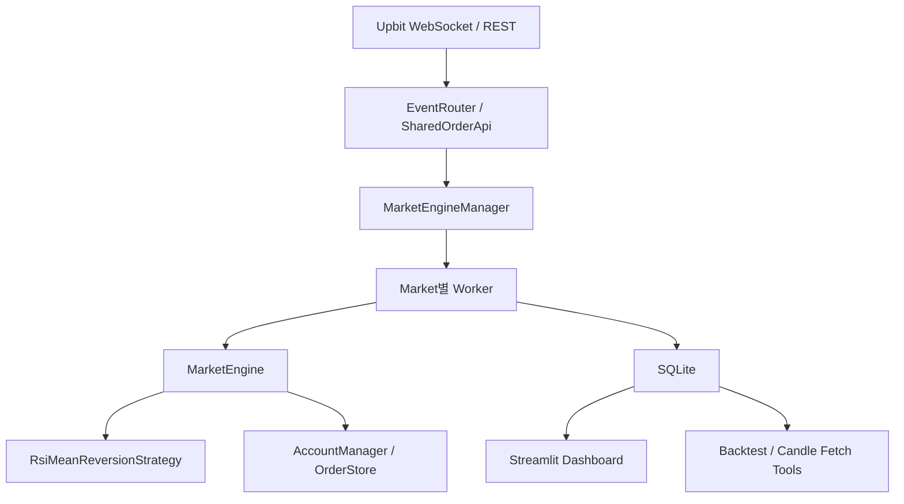

# CoinBot README 구조 설계

## 설계 목표

- 대상 독자: **C++ 개발자**
- 목적: 기능 소개보다 **설계 판단, 동시성 모델, 소유권/수명 관리, 장애 복구, 운영 흐름**이 잘 보이는 README를 만든다.
- 범위: `src/`의 C++ 실거래 봇만이 아니라, `SQLite + Streamlit + Python tools + deploy`까지 **프로젝트 일부**로 다룬다.

---

## 예시 README (VeTT) vs CoinBot 차이점

| 예시 (VeTT) | CoinBot에서는 |
|---|---|
| MSA 서비스별 컴포넌트 & 내부 API URI 나열 | 불필요. 대신 **외부 거래소 연동 구조**(Upbit REST/WebSocket, JWT, 재연결)를 설명 |
| Kafka/gRPC 통신 패턴 상세 설명 | 대신 **동시성 모델** (`std::jthread` + `BlockingQueue` + 마켓별 워커) 설명 |
| Transactional Outbox 패턴 코드 | 대신 **ReservationToken**, **주문 상태 전이**, **복구 경로**를 핵심 설계로 제시 |
| 여러 서버/여러 DB 아키텍처 | 대신 **단일 프로세스 C++ 런타임 + SQLite WAL + Streamlit/분석 도구** 구조 설명 |
| 서비스 API 문서 중심 | 대신 **왜 이 구현이 C++다운 설계인지**가 드러나도록 구성 |

---

## README 핵심 메시지

README를 다 읽고 나면 독자가 아래 5가지를 이해해야 한다.

1. CoinBot은 단순 전략 코드가 아니라 **실거래소와 연결되는 멀티마켓 자동매매 시스템**이다.
2. 핵심 구현 가치는 **스레드 모델, RAII 기반 자금 예약, 상태 전이, 복구 정책**에 있다.
3. C++ 런타임만 있는 프로젝트가 아니라 **데이터 적재, 분석, 백테스트, 운영 배포**까지 이어지는 구조다.
4. Windows와 Linux를 모두 언급하되, 실제 운영 축은 **Linux + systemd**, 개발 축은 **Windows/MSVC 또는 WSL**로 구분된다.
5. README는 “무엇을 만들었는가”보다 “**왜 이렇게 설계했는가**”를 중심으로 읽혀야 한다.

---

## 추천 README 구조

### 1. 타이틀 + 한 줄 소개
- 프로젝트명, 뱃지, 한 줄 설명
- 예시 문구:
  - `CoinBot`
  - `C++20 기반 Upbit 멀티마켓 자동매매 시스템`
  - `실시간 WebSocket 이벤트, 마켓별 워커 스레드, 주문 상태 복구, SQLite 기록, Streamlit 분석 도구를 포함한 개인 트레이딩 시스템`

### 2. 개발 환경 / 기술 스택
- 예시 README의 배지 구조를 참고하되, CoinBot 실제 기술만 넣는다.
- 추천 분류:
  - `Language`: C++20, Python
  - `Build`: CMake, MSVC, Ninja, Unix Makefiles
  - `Networking`: Boost.Asio, Boost.Beast, OpenSSL
  - `Data`: SQLite, nlohmann/json
  - `Analytics`: Streamlit, Pandas, Plotly
  - `Ops`: systemd, EC2

### 3. 프로젝트 소개
- 무엇을 하는 프로젝트인지
- 왜 만들었는지
- C++ 포트폴리오로서 어떤 점을 보여주는지

- 이 섹션에서 강조할 포인트:
  - Upbit REST/WebSocket 실거래 연동
  - 멀티마켓 독립 워커 구조
  - 주문/체결/복구 중심 상태 관리
  - 거래 데이터의 SQLite 적재와 분석 도구 연결

### 4. System Scope
- 이 README에서 반드시 추가할 섹션
- C++ 개발자 관점에서 “이 저장소가 어디까지를 책임지는지”를 짧게 정리한다.

- 권장 서술:
  - **C++ Runtime**: 실시간 이벤트 수신, 전략 실행, 주문 제출, 상태 복구
  - **Persistence Layer**: `candles`, `orders`, `signals`를 SQLite WAL DB에 저장
  - **Analysis Tooling**: Streamlit 대시보드, 과거 캔들 수집기, RSI 백테스트 스크립트
  - **Operations**: Linux systemd 서비스와 배포 스크립트

### 5. Key Dependencies and Features
- 예시 README의 `Key Dependencies and Features` 섹션에 대응
- CoinBot README의 핵심 섹션이 되어야 한다.
- 각 항목은 **설명 + 간단한 코드 스니펫 또는 Mermaid 흐름도**로 구성한다.

#### 5-1. Exchange Integration Layer
- `UpbitJwtSigner -> RestClient -> UpbitExchangeRestClient -> SharedOrderApi`
- 외부 거래소 API를 C++ 도메인 모델로 감싼 구조
- `SharedOrderApi`가 비스레드 안전 REST 클라이언트를 직렬화해 멀티마켓 워커가 공유 가능하게 만든 점

#### 5-2. Concurrency Model
- `MarketEngineManager`가 마켓당 하나의 `std::jthread`를 소유
- WebSocket IO 스레드 -> `EventRouter` -> `BlockingQueue` -> 마켓 워커
- 마켓별 단일 워커에서 `MarketEngine`가 thread-affinity를 보장하는 점

#### 5-3. ReservationToken 기반 자금 관리
- 매수 전 KRW 예약, 주문 실패/취소 시 자동 반환, 체결 시 정산
- `ReservationToken`이 **move-only RAII 토큰**이라는 점을 강조
- 주의:
  - README에 단순 XOR 불변식을 쓰지 말 것
  - 실제 모델은 `available_krw`, `reserved_krw`, `coin_balance`가 있는 **전량 거래 + transient state** 구조다

#### 5-4. Order Lifecycle and PositionEffect
- 주문 상태(`Pending`, `Filled`, `Canceled`, `Rejected`)와 포지션 효과(`Opened`, `Reduced`, `Closed`)를 분리
- 전략이 terminal 상태 이름이 아니라 실제 계좌 반영 결과를 기준으로 상태를 확정하는 구조
- “상태 이름”과 “실제 포지션 변화”를 분리한 설계 의도를 강조

#### 5-5. Recovery and Operational Resilience
- `StartupRecovery`: 재시작 시 **봇의 미체결 주문은 취소**하고, **포지션만 복구**
- 런타임 복구: pending timeout / private WS 재연결 후 `getOrder()` 기반 단건 복구
- `AbnormalExitGuard -> hasFatalWorker() -> exit(1) -> systemd Restart=on-failure`

#### 5-6. Raw JSON Routing and Deferred Parsing
- `EventRouter`는 raw JSON에서 마켓만 추출해 큐로 라우팅
- 실제 파싱은 마켓 워커에서 수행
- 이유:
  - IO 스레드 부하 최소화
  - 마켓별 순차 처리 보장
  - `fast path + fallback parse` 구조를 소개하면 C++ 개발자에게 인상적임

#### 5-7. Persistence and Analysis Pipeline
- 봇이 `candles`, `orders`, `signals`를 SQLite에 기록
- `WAL` 모드로 봇 쓰기와 Streamlit 읽기를 병행
- `tools/fetch_candles.py`가 과거 데이터를 적재하고, `tools/candle_rsi_backtest.py`가 전략을 근사 시뮬레이션

### 6. 아키텍처
- 이 섹션은 **1개의 큰 그림 + 1개의 보조 그림** 정도가 적당하다.

#### 6-1. Runtime Architecture
- 권장 레이어:
  - `core -> util -> api -> trading -> engine -> app`
- 단, 그림에는 `database`를 옆 축으로 따로 둔다.

#### 6-2. End-to-End Data Flow
- README에는 아래 흐름이 보여야 한다.



#### 6-3. Recovery Flow
- 별도 소형 Mermaid 추천
- 시작 복구와 런타임 복구를 분리해서 보여주면 좋다.

### 7. 트레이딩 전략
- 전략 설명은 짧고 명확하게
- 구현 복잡성보다 “어떤 입력을 받아 어떤 조건에서 어떤 주문을 만드는지”가 중요하다.

- 포함할 내용:
  - RSI Mean Reversion 전략 개요
  - oversold / overbought, volatility, trend strength 필터
  - intrabar 청산과 confirmed candle 청산의 차이
  - stop-loss / target / RSI exit

### 8. Build / Run / Deploy
- 이 섹션은 “한 플랫폼 설명”이 아니라 아래 3갈래로 나눈다.

#### 8-1. Windows Development Build
- Visual Studio + CMake preset + Ninja
- 개발/디버깅용이라고 명시

#### 8-2. Local Linux / WSL Run
- `.env.local`은 앱 자체 설정 포맷이 아니라 `scripts/run_local.sh`용 helper라고 명시
- 실제 필수값은 `UPBIT_ACCESS_KEY`, `UPBIT_SECRET_KEY`, `UPBIT_MARKETS`

#### 8-3. Linux Deployment
- `deploy/coinbot.service`
- `Restart=on-failure`
- `WorkingDirectory`, mountpoint/sentinel 검증

### 9. 프로젝트 구조
- `src/`만 보여주지 말고, 저장소 전체 구조를 보여준다.

```text
src/
  core/        # 도메인 타입, BlockingQueue
  util/        # Config, Logger
  api/         # JWT, REST, WebSocket, Upbit mapper/DTO
  trading/     # 지표, 전략, 자금 관리
  engine/      # MarketEngine, OrderStore, 엔진 이벤트
  app/         # CoinBot, MarketEngineManager, EventRouter, StartupRecovery
  database/    # SQLite RAII 래퍼, schema

streamlit/
  app.py       # 실거래 분석 대시보드

tools/
  fetch_candles.py        # 과거 캔들 적재
  candle_rsi_backtest.py  # 전략 근사 백테스트

deploy/
  coinbot.service
  deploy.sh
```

### 10. Trade-offs / Known Limits
- C++ 개발자 대상 README라면 이 섹션이 있는 편이 신뢰도가 높다.
- 너무 길게 쓰지 말고 3~4개만 정리한다.

- 예시:
  - 큐 포화 시 `drop-oldest` 정책
  - graceful shutdown 미완성
  - 백테스트는 실전 엔진의 근사 모델
  - 외부 수동 거래와의 상태 불일치 전제

---

## 실제 작성 시 강조할 문장

- “이 프로젝트는 전략 구현보다 **실시간 이벤트 처리와 상태 일관성 유지**에 더 많은 설계 노력을 들였다.”
- “멀티마켓은 병렬 실행되지만, 각 마켓 내부 상태는 **단일 워커 스레드 소유권**으로 단순화했다.”
- “주문 상태와 포지션 상태를 분리해, 거래소 이벤트 유실이나 부분 체결에도 상태 전이를 안정적으로 처리했다.”
- “실거래 데이터는 SQLite에 축적되고, Streamlit/백테스트 도구가 같은 저장소를 기반으로 분석을 수행한다.”

---

## 작성 시 주의사항

1. `외부 API 없음`처럼 사실과 다른 전제를 쓰지 말 것
2. `StartupRecovery`를 “미체결 주문 복원”으로 표현하지 말 것
3. `ReservationToken` 설명에서 단순 XOR 불변식을 강한 규칙처럼 쓰지 말 것
4. Windows와 Linux를 대칭적으로 쓰지 말고, **개발 환경**과 **운영 환경**을 구분할 것
5. `streamlit/`, `tools/`, `deploy/`를 부록이 아니라 프로젝트 일부로 노출할 것
6. README는 changelog처럼 쓰지 말고, **설계 설명 + 시스템 소개** 중심으로 구성할 것

---

## 한 줄 결론

CoinBot README는 “자동매매 봇” 소개문보다, **C++로 만든 실시간 이벤트 처리/복구/분석 시스템 포트폴리오**로 읽히게 설계해야 한다.
