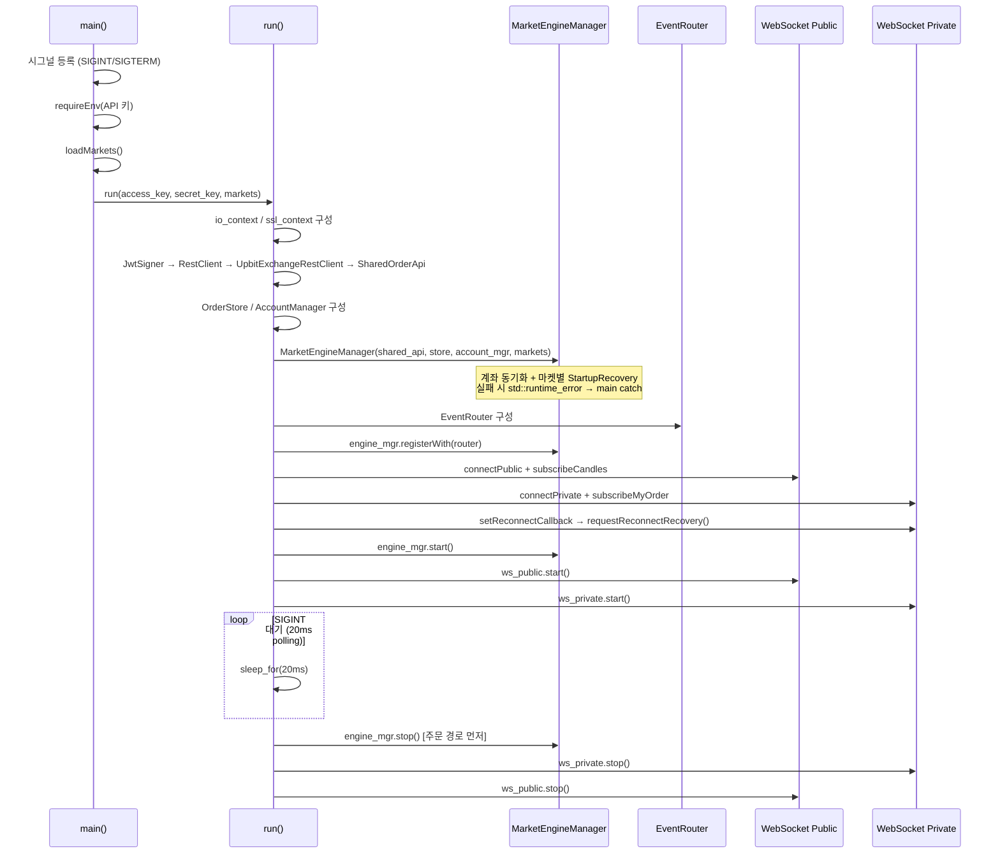

# CoinBot.cpp

> **대상 파일**
> - `src/app/CoinBot.cpp`

---

## 한눈에 보기

| 항목 | 내용 |
|------|------|
| **위치** | `src/app/` |
| **역할** | 봇 전체 컴포넌트 조립 + 실행 진입점 |
| **호출 시점** | 프로세스 시작 (`main` 진입) |
| **핵심 입력** | 환경 변수 (`UPBIT_ACCESS_KEY`, `UPBIT_SECRET_KEY`, `UPBIT_MARKETS`) |
| **핵심 출력** | 봇 실행 루프 (SIGINT/SIGTERM 수신까지 블로킹) |
| **종료 정책** | `engine_mgr.stop()` → `ws_private.stop()` → `ws_public.stop()` |

---

## 1. 왜 이 파일이 필요한가

CoinBot은 여러 컴포넌트가 협력해서 동작한다.

```
문제 1: 각 컴포넌트의 의존성 순서가 복잡하다
         → 조립 순서가 잘못되면 null 참조 / 미등록 이벤트 발생

문제 2: 컴포넌트별 생명주기(시작/종료) 순서가 다르다
         → 잘못된 순서로 멈추면 종료 중 추가 주문이 발생할 수 있다

문제 3: 예기치 않은 종료(Ctrl+C, 서버 kill) 처리가 필요하다
         → 시그널 없이는 프로세스가 강제 종료돼 정리 코드가 실행되지 않는다
```

`CoinBot.cpp`는 이 문제를 해결하기 위해,
컴포넌트 **조립 순서**, **시작 순서**, **종료 순서**를 단일 파일에 명시적으로 고정한다.

---

## 2. 전체 실행 흐름



> [!important] 시작/종료 순서 불변 원칙
> - **시작**: `MarketEngineManager.start()` → WS → (이후 이벤트 수신)
> - **종료**: `engine_mgr.stop()` 먼저 → WS 나중
>   - 종료 중 WS 이벤트가 들어와 엔진이 추가 주문을 내는 상황을 방지한다.

---

## 3. 시그널 핸들러 (anonymous namespace)

```cpp
namespace {
    volatile std::sig_atomic_t g_stop_requested = 0;

    void onSignal(int) { g_stop_requested = 1; }
}
```

`main()`에서 등록:
```cpp
std::signal(SIGINT,  onSignal);   // Ctrl+C
std::signal(SIGTERM, onSignal);   // kill 명령
```

`run()` 안에서 폴링:
```cpp
while (!g_stop_requested)
    std::this_thread::sleep_for(std::chrono::milliseconds(20));
```

> [!note] `volatile std::sig_atomic_t`를 쓰는 이유
> 시그널 핸들러는 일반 코드와 **비동기적으로** 실행된다.
> - `volatile`: 컴파일러가 캐시(레지스터)에 두지 않고 메모리에서 직접 읽도록 강제
> - `sig_atomic_t`: 플랫폼이 원자적 읽기/쓰기를 보장하는 정수 타입 (C 표준)
>
> 일반 `bool`이나 `int`를 쓰면 컴파일러 최적화에 의해 루프가 무한 반복될 수 있다.

---

## 4. API 키 로딩

```cpp
// 환경 변수에서 값을 읽어 optional로 반환 (없거나 빈 값이면 nullopt)
static std::optional<std::string> readEnv(const char* name)
{
#ifdef _WIN32
    char* raw = nullptr;
    size_t raw_len = 0;
    if (_dupenv_s(&raw, &raw_len, name) != 0 || raw == nullptr)
        return std::nullopt;

    std::string value(raw);
    std::free(raw);          // _dupenv_s는 힙 할당 → 반드시 free
#else
    const char* raw = std::getenv(name);
    if (!raw) return std::nullopt;
    std::string value(raw);
#endif
    if (value.empty()) return std::nullopt;
    return value;
}

// 없으면 즉시 예외 (봇 실행 전제 조건)
static std::string requireEnv(const char* name)
{
    auto value = readEnv(name);
    if (!value.has_value())
        throw std::runtime_error(std::string("환경 변수가 없습니다: ") + name);
    return *value;
}
```

> [!note] `_dupenv_s` vs `std::getenv`
> - Windows: `std::getenv`는 deprecated(MSVC 경고). `_dupenv_s`가 공식 대안.
>   - `_dupenv_s`는 힙에 새 버퍼를 할당하므로 `std::free` 호출이 필수다.
> - POSIX: `std::getenv`가 정적 버퍼를 반환 → `free` 불필요.
>
> `#ifdef _WIN32`로 플랫폼별 처리를 분리해 두 환경 모두 안전하게 동작한다.

> [!tip] API 키를 환경 변수로 관리하는 이유
> 코드나 설정 파일에 직접 넣으면 Git에 실수로 커밋될 위험이 있다.
> 환경 변수는 프로세스 외부에서 주입하므로 소스 코드 유출 위험이 없다.

---

## 5. 마켓 목록 로딩

```cpp
static std::vector<std::string> loadMarkets()
{
    // 환경 변수 우선 (CSV 형식: "KRW-BTC,KRW-ETH,KRW-XRP")
    auto env = readEnv("UPBIT_MARKETS");
    if (!env.has_value())
        return util::AppConfig::instance().bot.markets;   // 없으면 Config 기본값

    std::vector<std::string> result;
    std::istringstream ss(*env);
    std::string token;
    while (std::getline(ss, token, ','))   // ',' 기준으로 분리
        if (!token.empty()) result.push_back(token);

    // 파싱 결과가 비어 있으면 Config 기본값으로 fallback
    return result.empty() ? util::AppConfig::instance().bot.markets : result;
}
```

**우선순위 정책:**

```
UPBIT_MARKETS 환경 변수 존재?
  → YES: CSV 파싱 결과 사용
          (파싱 결과가 빈 경우엔 Config 기본값으로 fallback)
  → NO : AppConfig::instance().bot.markets 사용
```

---

## 6. REST 클라이언트 체인

```cpp
// 1단계: JWT 서명기 (API 키 보관, 요청마다 토큰 생성)
api::auth::UpbitJwtSigner signer(access_key, secret_key);

// 2단계: HTTP 클라이언트 (Boost.Beast, io_context 기반)
api::rest::RestClient rest_client(ioc, ssl_ctx);

// 3단계: Upbit REST 어댑터 (순수 HTTP + JSON 변환, 스레드 비안전)
auto exchange_client = std::make_unique<api::rest::UpbitExchangeRestClient>(
    rest_client, std::move(signer));

// 4단계: 멀티스레드 래퍼 (mutex 직렬화, IOrderApi 구현)
api::upbit::SharedOrderApi shared_api(std::move(exchange_client));
```

계층 구조:

```
SharedOrderApi  ← 마켓별 워커 스레드가 공유 (mutex 직렬화)
    │
    └── UpbitExchangeRestClient  ← 스레드 비안전, SharedOrderApi 내부에서만 호출
            │
            ├── RestClient       ← Boost.Beast HTTP (io_context 기반)
            └── UpbitJwtSigner   ← 요청별 JWT 토큰 생성
```

> [!note] `unique_ptr` 이전 후 `shared_api`가 소유
> `std::move(exchange_client)`로 소유권을 `shared_api`에 넘긴다.
> 이후 `exchange_client`는 null이므로 `shared_api`를 통해서만 접근 가능하다.
> 이 구조가 "스레드 비안전한 클라이언트를 mutex 래퍼 밖에서 직접 호출하는 실수"를 막는다.

---

## 7. 공유 자원 구성

```cpp
// 모든 마켓이 공유하는 주문 저장소 (마켓별 필터링은 MarketEngine이 담당)
engine::OrderStore order_store;

// 계좌 관리자: 초기값 빈 Account, 마켓 목록으로 예산 슬롯 생성
trading::allocation::AccountManager account_mgr(core::Account{}, markets);
```

> [!important] 수명(lifetime) 보장
> `order_store`와 `account_mgr`은 스택에 선언되어 `run()` 함수가 끝날 때까지 살아있다.
> `MarketEngineManager`는 이 둘을 **참조**로 보관하므로,
> `engine_mgr`이 `order_store` / `account_mgr`보다 먼저 소멸해야 한다.
>
> C++ 스택 소멸 순서는 선언의 역순이므로, 선언 순서만 지키면 안전하다:
> ```
> OrderStore        (1번 선언 → 마지막 소멸)
> AccountManager    (2번 선언 → 두 번째 소멸)
> MarketEngineManager (3번 선언 → 먼저 소멸)  ← 참조 사용 완료 후 소멸 보장
> ```

---

## 8. WebSocket 구성

### Public WS (캔들)

```cpp
api::ws::UpbitWebSocketClient ws_public(ioc, ssl_ctx);

// 수신 JSON → EventRouter::routeMarketData 로 전달
ws_public.setMessageHandler([&router](std::string_view json) {
    (void)router.routeMarketData(json);
});

ws_public.connectPublic("api.upbit.com", "443", "/websocket/v1");
ws_public.subscribeCandles("candle.1m", markets, false, true);
//                              ↑ 1분봉       ↑ 스냅샷 미포함  ↑ isOnly=true
```

### Private WS (myOrder)

```cpp
api::ws::UpbitWebSocketClient ws_private(ioc, ssl_ctx);

// 수신 JSON → EventRouter::routeMyOrder 로 전달
ws_private.setMessageHandler([&router](std::string_view json) {
    (void)router.routeMyOrder(json);
});

// [핵심] 재연결 시 복구 트리거 등록
ws_private.setReconnectCallback([&engine_mgr]() {
    engine_mgr.requestReconnectRecovery();
});

// Private WS는 JWT Bearer 토큰으로 인증
api::auth::UpbitJwtSigner signer_for_ws(access_key, secret_key);
const std::string ws_bearer = signer_for_ws.makeBearerToken(std::nullopt);

ws_private.connectPrivate("api.upbit.com", "443", "/websocket/v1/private", ws_bearer);
ws_private.subscribeMyOrder(markets, true);
```

> [!important] 재연결 콜백 역할
> Private WS가 재연결되면 이전 세션에서 유실된 `myOrder` 이벤트를 복구할 수 없다.
> `requestReconnectRecovery()`는 각 마켓의 `recovery_requested` atomic flag를 `true`로 설정하고,
> 워커 루프 다음 턴에서 `runRecovery_`가 REST API로 주문 단건 조회를 시도한다.
>
> 이 콜백이 없으면 재연결 후 체결된 주문이 전략에 반영되지 않아
> Pending 상태가 영구 지속될 수 있다.

> [!note] `(void)router.routeXxx(json)` 패턴
> `routeMarketData` / `routeMyOrder`의 반환값(에러 여부 등)을 현재 사용하지 않는다.
> `(void)` 캐스트는 "반환값을 의도적으로 무시한다"는 명시적 표현으로,
> 컴파일러의 unused-return-value 경고를 억제한다.

---

## 9. 시작 / 정지 순서

### 시작

```cpp
engine_mgr.start();   // ① 마켓별 워커 스레드 시작 (이벤트 소비 준비)
ws_public.start();    // ② 캔들 이벤트 수신 시작
ws_private.start();   // ③ myOrder 이벤트 수신 시작
```

> [!tip] 왜 `registerWith(router)`가 `start()` 전에 있어야 하는가?
> `start()` 이전에 WS가 이벤트를 보내면 EventRouter에 큐가 없어 이벤트가 유실된다.
> `registerWith` → `start()` 순서로 "큐 등록 후 이벤트 수신"이 보장된다.

### 정지

```cpp
engine_mgr.stop();    // ① 주문 경로 먼저 차단 (워커 스레드 join 포함)
ws_private.stop();    // ② Private WS 종료
ws_public.stop();     // ③ Public WS 종료
```

> [!warning] `engine_mgr.stop()` 먼저인 이유
> WS를 먼저 멈추면 아직 남아있는 WS 이벤트 처리가 중단될 수 있다.
> 반대로 WS를 켜둔 채 엔진을 멈추면, 종료 중에 들어온 이벤트가
> 이미 정지 신호를 받은 워커 큐에 쌓여 처리되지 않는다.
>
> 현재 정책: **엔진(소비자)을 먼저 멈춰** 주문 경로를 차단한 뒤 WS(생산자)를 종료한다.

---

## 10. `main()` 구조

```cpp
int main()
{
    // 시그널 등록
    std::signal(SIGINT,  onSignal);
    std::signal(SIGTERM, onSignal);

    // API 키 로딩 (없으면 즉시 종료)
    std::string access_key, secret_key;
    try {
        access_key = requireEnv("UPBIT_ACCESS_KEY");
        secret_key = requireEnv("UPBIT_SECRET_KEY");
    } catch (const std::exception& e) {
        logger.error("[CoinBot] ", e.what());
        return 1;
    }

    // 마켓 목록
    const std::vector<std::string> markets = loadMarkets();

    // 봇 실행 (예외 전파 포함)
    try {
        return run(access_key, secret_key, markets);
    } catch (const std::exception& e) {
        logger.error("[CoinBot] Fatal: ", e.what());
        return 1;
    }
}
```

**예외 처리 계층:**

```
main()
  ├─ API 키 로딩 실패 → return 1 (즉시 종료)
  └─ run() 예외
       └─ MarketEngineManager 생성자: 계좌 동기화 실패
            → std::runtime_error → main catch → return 1
```

> [!note] `run()`을 별도 함수로 분리한 이유
> 스택 변수(`ioc`, `ssl_ctx`, `engine_mgr`, `ws_public`, `ws_private` 등)의
> 소멸 순서를 `run()` 함수의 스택 프레임 안에서 완전히 제어하기 위해서다.
>
> `main()` 안에 모두 넣으면 `return 1` 경로에서도 정리 코드가 실행돼야 하는데,
> 예외가 발생한 경우 소멸자가 역순으로 호출된다.
> `run()`을 별도 함수로 두면 `main()`은 예외를 잡고 return 코드만 결정하면 된다.

---

## 11. 설계 평가

**장점:**
- 조립 순서가 선형으로 고정되어 의존성 누락/순서 오류가 구조적으로 차단된다.
- `volatile sig_atomic_t` + 20ms polling으로 POSIX/Windows 공통 시그널 처리.
- Private WS 재연결 콜백으로 WS 유실 구간의 주문 복구 경로가 자동 트리거된다.
- `run()` 분리로 스택 소멸 순서가 명시적으로 제어된다.

**보완 포인트:**

| 항목 | 현재 | 개선 방향 |
|------|------|----------|
| 로그 경로 하드코딩 | `C:\\cpp\\CoinBot\\market_logs` 고정 | Config 또는 환경 변수로 주입 |
| Public WS 재연결 콜백 | 없음 | 캔들 유실 감지 후 복구 정책 추가 |
| 종료 타임아웃 | 없음 | stop() 이후 일정 시간 내 join 안 되면 강제 종료 |
| 마켓 목록 검증 | 없음 | 빈 문자열, 중복, 유효하지 않은 마켓 ID 필터 |

---

## 12. 결론

`CoinBot.cpp`는 봇의 **조립도(wiring diagram)** 역할을 한다.

```
환경 변수 → API 키 / 마켓 목록
    ↓
REST 체인: JwtSigner → RestClient → UpbitExchangeRestClient → SharedOrderApi
    ↓
공유 자원: OrderStore, AccountManager
    ↓
MarketEngineManager (계좌 동기화 + 복구) → EventRouter 등록
    ↓
WebSocket Public  (캔들) → router.routeMarketData
WebSocket Private (주문) → router.routeMyOrder + 재연결 복구 콜백
    ↓
start() → SIGINT 대기 → stop()
```

각 컴포넌트의 내부 로직은 독립 클래스에 위임하고,
`CoinBot.cpp`는 "무엇을 어떤 순서로 연결하고 시작·정지하는가"만 담당한다.
