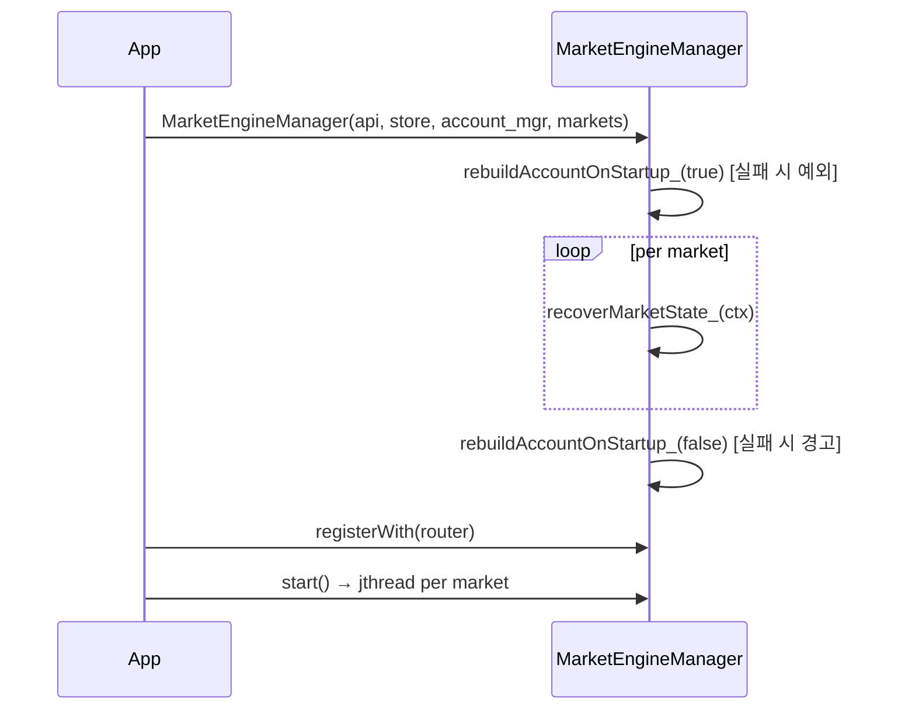
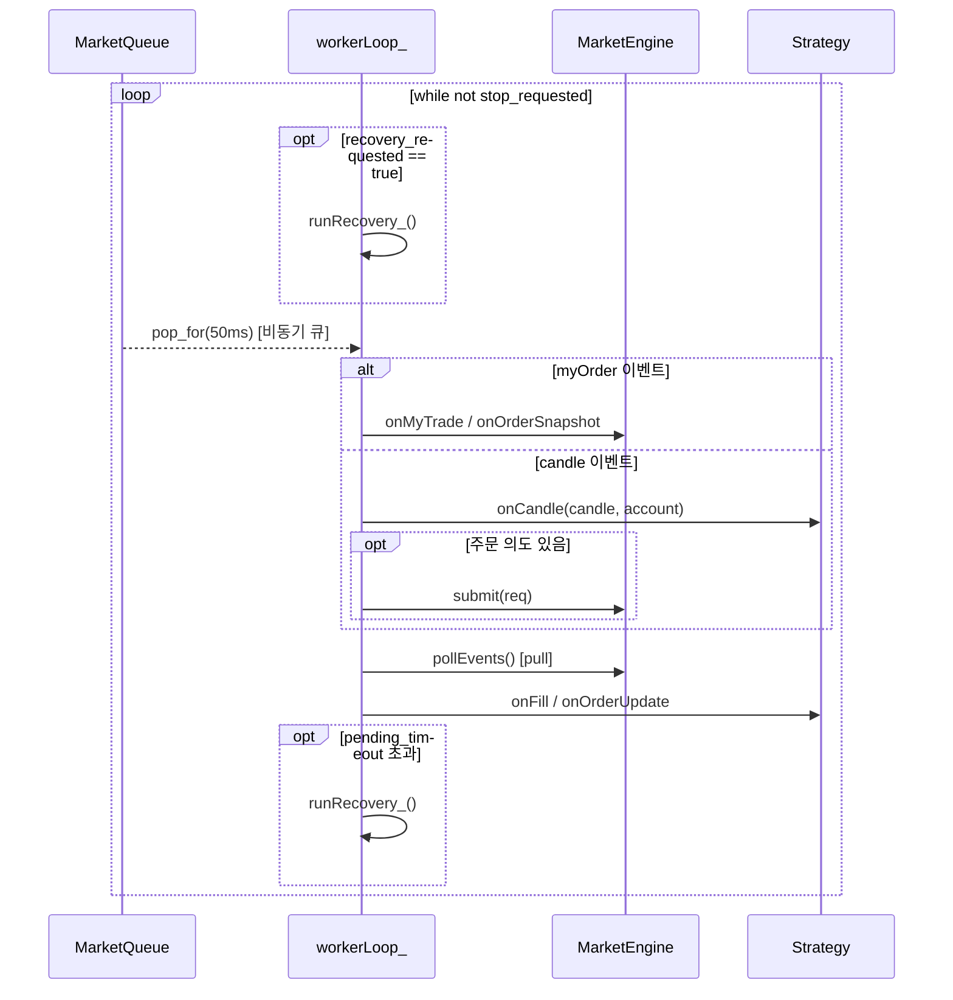

# MarketEngineManager.cpp

> **대상 파일**
> - `src/app/MarketEngineManager.cpp`

---

## 한눈에 보기

| 항목 | 내용 |
|------|------|
| **위치** | `src/app/` |
| **역할** | 멀티마켓 런타임 실행 루프 구현 (초기화/복구/워커/이벤트 처리) |
| **핵심 경계** | `EventRouter` 입력 ↔ `MarketEngine` 처리 ↔ `Strategy` 상태 전이 |
| **실행 모델** | 마켓별 `jthread` + 마켓별 큐 + 공유 `AccountManager` |
| **복구 모델** | 시작 복구(StartupRecovery) + 런타임 복구(runRecovery_) 분리 |

---

## 1. 왜 이 cpp가 중요한가

`MarketEngineManager.h`가 "무엇을 하는 클래스인가"를 정의한다면,
이 `.cpp`는 "어떻게 안전하게 실행하는가"를 구현한다.

핵심은 아래 4가지다.

1. 시작 시 계좌/전략 상태 정렬
2. 마켓별 독립 워커 루프 실행
3. WS 원시 이벤트를 엔진/전략 도메인 이벤트로 변환
4. pending 장기화/재연결 상황에서 자동 복구

---

## 2. 전체 실행 흐름

### 2-A. 초기화 흐름



### 2-B. 워커 런타임 루프 (마켓별 1회 이터레이션)

> `workerLoop_`는 MEM의 private 메서드이며, jthread 위에서 실행된다.
> WK는 독립 객체가 아닌 MEM 내부 실행 문맥이다.



---

## 3. 파일 상단 유틸리티

### 3.1 `toStringState(...)`

```cpp
const char* toStringState(RsiMeanReversionStrategy::State s)
```

- 전략 상태 enum을 로그 문자열로 변환한다.
- 로직 영향은 없고 관측성(observability)을 높이는 용도다.

```cpp
switch (s) {
case S::Flat:         return "Flat";
case S::PendingEntry: return "PendingEntry";
case S::InPosition:   return "InPosition";
case S::PendingExit:  return "PendingExit";
default:              return "Unknown";
}
```

### 3.2 `orderSizeToLog(const core::OrderSize&)`

```cpp
std::string orderSizeToLog(const core::OrderSize& size)
{
    return std::visit([](const auto& s) -> std::string {
        using T = std::decay_t<decltype(s)>;
        std::ostringstream oss;
        if constexpr (std::is_same_v<T, core::VolumeSize>)
            oss << "VOL=" << s.value;    // 수량 주문
        else if constexpr (std::is_same_v<T, core::AmountSize>)
            oss << "AMOUNT=" << s.value; // 금액 주문
        else
            oss << "<UNKNOWN_SIZE>";
        return oss.str();
    }, size);
}
```

- `OrderSize` variant를 `VOL=...` 또는 `AMOUNT=...`로 포맷한다.
- 주문 의도 로그에서 "수량 주문인지 금액 주문인지"를 즉시 구분하게 해준다.

---

## 4. 생성자 `MarketEngineManager::MarketEngineManager(...)`

생성자는 단순 멤버 초기화가 아니라 "시작 준비 파이프라인"이다.

### 4.1 단계별 동작

1. 멤버 참조 바인딩 (`api_`, `store_`, `account_mgr_`, `cfg_`)
2. 1차 계좌 동기화 `rebuildAccountOnStartup_(true)`
3. 마켓 루프:
   - 중복 마켓 방어
   - `MarketContext` 생성
   - `MarketEngine` 생성
   - 전략 생성
   - `recoverMarketState_` 실행
   - `contexts_`에 저장
4. 복구 직후 예산 로그
5. 2차 계좌 동기화 `rebuildAccountOnStartup_(false)`
6. 최종 예산 로그 + 초기화 완료 로그

### 4.2 중요한 코드 포인트

```cpp
// 중복 마켓 입력 방어: 덮어쓰면 이전 큐 포인터가 댕글링될 수 있음
if (contexts_.count(market) > 0) {
    logger.warn("Duplicate market skipped");
    continue;
}
```

```cpp
rebuildAccountOnStartup_(/*throw_on_fail=*/true);   // 1차: 정합성 필수
...
rebuildAccountOnStartup_(/*throw_on_fail=*/false);  // 2차: 가용성 우선
```

- 1차는 강한 실패 정책(초기 정합성 필수),
- 2차는 가용성 우선 정책(복구 후 최종 맞춤).

### 4.3 입출력/실패 정책

| 관점 | 내용 |
|------|------|
| 입력 | API, Store, AccountManager, markets, cfg |
| 출력 | 실행 가능한 `contexts_` 완성 |
| 강제 실패 | 1차 계좌 동기화 실패 |
| 완화 실패 | 마켓 복구 실패, 2차 동기화 실패 |

---

## 5. 소멸자 `~MarketEngineManager()`

```cpp
MarketEngineManager::~MarketEngineManager() { stop(); }
```

- 호출자가 `stop()`을 놓쳐도 워커를 정리한다.
- 워커 누수/비정상 종료 위험을 줄이는 안전망이다.

---

## 6. `registerWith(EventRouter&)`

```cpp
for (auto& [market, ctx] : contexts_)
    router.registerMarket(market, ctx->event_queue);
```

- 마켓 문자열 → 해당 큐의 라우팅 테이블을 구성한다.
- 이 호출 이전엔 이벤트가 워커 큐로 들어갈 수 없다.

---

## 7. `start()` / `stop()`

### 7.1 `start()`

```cpp
for (auto& [market, ctx] : contexts_)
{
    // jthread 생성 시 stop_token이 자동으로 전달됨
    ctx->worker = std::jthread([this, &ctx_ref = *ctx](std::stop_token stoken) {
        workerLoop_(ctx_ref, stoken);
    });
}
started_ = true;
```

- 이미 시작된 상태면 즉시 반환(`started_` 가드)
- 마켓별 `jthread` 시작
- 핵심은 "마켓별 독립 스레드"다.

### 7.2 `stop()`

```cpp
for (auto& [market, ctx] : contexts_)
    ctx->worker.request_stop();         // stop 신호 전달

for (auto& [market, ctx] : contexts_)
    if (ctx->worker.joinable())
        ctx->worker.join();             // 종료 대기

started_ = false;
```

- 시작 안 된 상태면 즉시 반환
- 종료 순서를 명확히 고정해 dangling 실행을 막는다.

---

## 8. `rebuildAccountOnStartup_(bool throw_on_fail)`

### 8.1 역할

- 시작 시 거래소 계좌를 조회해 `AccountManager::rebuildFromAccount()`를 호출한다.
- 전체 KRW/코인 예산을 "거래소 실제 상태 기준"으로 재구성한다.

### 8.2 상세 동작

```cpp
for (int attempt = 1; attempt <= cfg_.sync_retry; ++attempt)
{
    auto result = api_.getMyAccount();

    if (std::holds_alternative<core::Account>(result))
    {
        account_mgr_.rebuildFromAccount(std::get<core::Account>(result));
        return true;    // 성공
    }

    // 마지막 시도가 아니면 1초 대기
    if (attempt < cfg_.sync_retry)
        std::this_thread::sleep_for(std::chrono::seconds(1));
}

if (throw_on_fail)
    throw std::runtime_error("Failed to sync account after N attempts");

return false;   // 경고 후 계속
```

1. `cfg_.sync_retry` 횟수만큼 `api_.getMyAccount()` 재시도
2. 성공 시 `account_mgr_.rebuildFromAccount(...)` 후 `true` 반환
3. 실패 누적 시:
   - `throw_on_fail == true`: `runtime_error` 던짐
   - `false`: 경고 로그 후 `false` 반환

### 8.3 왜 시작 전용인가

런타임에서는 전체 재구축이 타 마켓 KRW 분배를 다시 계산해
활성 주문 상태와 충돌할 수 있다.
그래서 런타임은 `runRecovery_` 경로를 사용한다.

---

## 9. `recoverMarketState_(MarketContext&)`

### 9.1 역할

- 마켓별 시작 복구 래퍼
- 내부에서 `StartupRecovery::run(...)` 호출

### 9.2 핵심 코드

```cpp
StartupRecovery::Options opt;
// 내 전략 + 내 마켓 주문만 취소/복구 대상이 되도록 스코프를 좁힘
opt.bot_identifier_prefix =
    std::string(ctx.strategy->id()) + ":" + ctx.market + ":";
// 예: "rsi_mean_reversion:KRW-BTC:"

StartupRecovery::run(api_, ctx.market, opt, *ctx.strategy);
```

### 9.3 실패 정책

- 예외를 잡고 경고 로그만 남긴다.
- 한 마켓 복구 실패가 전체 매니저 생성 실패로 번지지 않게 설계했다.

---

## 10. `workerLoop_(MarketContext&, std::stop_token)`

실행 핵심 루프다.

### 10.1 루프 전 준비

```cpp
// 워커 로그를 마켓 파일로 분리하기 위한 태그 설정
util::Logger::setThreadTag(ctx.market);
struct ThreadTagGuard final {
    ~ThreadTagGuard() { util::Logger::clearThreadTag(); }
} tag_guard;  // RAII: 루프 종료 시 태그 자동 정리

// 엔진을 현재 워커 스레드에 바인딩
ctx.engine->bindToCurrentThread();
```

바인딩 실패 시:
- 해당 마켓 워커만 종료
- 프로세스 전체는 유지

### 10.2 반복 1회 상세 순서

```cpp
while (!stoken.stop_requested())
{
    try
    {
        // 1) 복구 요청은 일반 이벤트보다 먼저 처리
        if (ctx.recovery_requested.exchange(false, std::memory_order_acq_rel))
            runRecovery_(ctx);

        // 2) 큐에서 이벤트 대기 (50ms 후 없으면 nullptr 반환)
        auto maybe = ctx.event_queue.pop_for(50ms);
        if (maybe.has_value())
            handleOne_(ctx, *maybe);

        // 3) 엔진이 쌓아둔 이벤트를 전략으로 전달 (pull 방식)
        auto out = ctx.engine->pollEvents();
        if (!out.empty())
            handleEngineEvents_(ctx, out);

        // 4) Pending 상태 타임아웃 감시
        checkPendingTimeout_(ctx);
    }
    catch (const std::exception& e)
    {
        // 이벤트 하나 건너뛰고 계속 — 워커는 유지됨
        logger.error("...", e.what());
    }
}
```

### 10.3 예외 격리

루프 내부 전체를 `try-catch`로 감싸서
"나쁜 이벤트 1건"이 워커 전체 중단으로 이어지지 않게 한다.

---

## 11. `handleOne_(..., const EngineInput&)`

variant 디스패처다.

```cpp
std::visit([&](const auto& x)
{
    using T = std::decay_t<decltype(x)>;

    if constexpr (std::is_same_v<T, engine::input::MyOrderRaw>)
        handleMyOrder_(ctx, x);
    else if constexpr (std::is_same_v<T, engine::input::MarketDataRaw>)
        handleMarketData_(ctx, x);
    else if constexpr (std::is_same_v<T, engine::input::AccountSyncRequest>)
        runRecovery_(ctx);  // 기존 큐 이벤트 호환 경로 (현재는 atomic flag 우선)

}, in);
```

> [!note] `if constexpr`란?
> 컴파일 타임에 타입을 확인해 분기한다.
> `std::visit`과 함께 쓰면 variant의 각 타입마다 다른 코드가 인스턴스화된다.
> 런타임 오버헤드 없이 타입 안전한 분기를 구현하는 C++17 패턴이다.

로직을 여기서 직접 처리하지 않고 분기만 담당해
함수 책임이 명확하다.

---

## 12. `handleMyOrder_(..., const MyOrderRaw&)`

주문/체결 이벤트 처리의 핵심 경로다.

### 12.1 처리 단계

```cpp
// 1) JSON 파싱
const nlohmann::json j = nlohmann::json::parse(raw.json, nullptr, false);
if (j.is_discarded()) { /* 로그 후 drop */ return; }

// 2) DTO 변환
api::upbit::dto::UpbitMyOrderDto dto = j.get<UpbitMyOrderDto>();

// 3) DTO → (Order snapshot, MyTrade) 이벤트 분해
const auto events = api::upbit::mappers::toEvents(dto);

// 4) MyTrade 존재 여부 사전 확인 (done-only 감지용)
bool has_trade = false;
for (const auto& ev : events)
    if (std::holds_alternative<core::MyTrade>(ev)) { has_trade = true; break; }

// 5) 이벤트 순회 처리
for (const auto& ev : events) { ... }
```

### 12.2 done-only 보정 로직

```cpp
if (!has_trade && isTerminal)
{
    // 터미널 상태인데 MyTrade 이벤트가 없는 경우:
    // onOrderSnapshot만으로는 delta 정산(finalizeFillBuy/Sell)이 누락됨
    // → reconcileFromSnapshot으로 정산 시도
    if (!ctx.engine->reconcileFromSnapshot(o))
    {
        // 정산 불확실 → 다음 루프에서 복구 재시도 예약
        ctx.recovery_requested.store(true, std::memory_order_release);
    }
}
else
{
    ctx.engine->onOrderSnapshot(o);
}
```

### 12.3 실패 시 동작

- JSON/DTO 실패: 로그 후 해당 이벤트만 drop
- 엔진 처리 예외: 상위 `workerLoop_`에서 격리 처리

---

## 13. `handleMarketData_(..., const MarketDataRaw&)`

전략 실행 경로다.

### 13.1 단계별 동작

1. JSON 파싱
2. `type`이 `candle` prefix인지 확인
3. DTO 변환 → 도메인 `core::Candle` 변환
4. `pending_candle`로 분봉 확정 처리
5. `buildAccountSnapshot_`로 전략 계좌 입력 생성
6. `strategy->onCandle(candle, account)` 호출
7. 주문 의도(`Decision`)가 있으면 `engine->submit(req)`
8. submit 실패 시 `strategy->onSubmitFailed()`

### 13.2 분봉 확정 로직

```cpp
// 첫 번째 캔들: pending에 저장하고 대기
if (!ctx.pending_candle.has_value()) {
    ctx.pending_candle = incoming;
    return;
}

// 같은 분봉의 중간 업데이트: 최신값으로 덮어쓰기
if (ctx.pending_candle->start_timestamp == incoming.start_timestamp) {
    ctx.pending_candle = incoming;
    return;
}

// 새 분봉 도착 → 이전 분봉을 "확정 close"로 처리
const core::Candle candle = *ctx.pending_candle;
ctx.pending_candle = incoming;
// → candle로 전략 실행
```

```
시간 흐름: [분봉 A 업데이트들] [분봉 B 첫 수신]
                                    ↑
                           이 시점에 분봉 A가 확정됨
```

- 같은 분봉의 중간 업데이트는 최신값으로 덮어씀
- 다음 분봉이 와야 이전 분봉을 "확정 close"로 처리
- 이 방식은 실시간 candle 스트림의 흔들림에 강하다.

### 13.3 submit 실패 롤백

전략은 submit 직후 pending 상태로 전이할 수 있으므로,
실제 주문 실패 시 `onSubmitFailed()`로 즉시 롤백한다.

```cpp
const auto r = ctx.engine->submit(req);
if (!r.success)
    ctx.strategy->onSubmitFailed();  // 전략 상태 롤백
```

---

## 14. `handleEngineEvents_(..., const vector<EngineEvent>&)`

엔진 출력 이벤트를 전략 입력 이벤트로 변환한다.

```cpp
for (const auto& ev : evs)
{
    if (std::holds_alternative<engine::EngineFillEvent>(ev))
    {
        const auto& e = std::get<engine::EngineFillEvent>(ev);

        // 엔진 이벤트 → 전략용 FillEvent로 변환
        const trading::FillEvent fill{
            e.identifier,
            e.position,
            static_cast<double>(e.fill_price),
            static_cast<double>(e.filled_volume)
        };
        ctx.strategy->onFill(fill);
    }
    else if (std::holds_alternative<engine::EngineOrderStatusEvent>(ev))
    {
        const auto& e = std::get<engine::EngineOrderStatusEvent>(ev);

        trading::OrderStatusEvent out{
            e.identifier,
            e.status,
            e.position,
            e.executed_volume,
            e.remaining_volume
        };
        ctx.strategy->onOrderUpdate(out);
    }
}
```

이 환류가 없으면 전략 상태는 주문 현실과 분리된다.

---

## 15. `buildAccountSnapshot_(market) const`

```cpp
trading::AccountSnapshot snap{};

auto budget = account_mgr_.getBudget(market);
if (budget.has_value())
{
    snap.krw_available = budget->available_krw;
    snap.coin_available = budget->coin_balance;
}

return snap;
```

- 전략에 필요한 최소 필드로 축약한다.
- 전략이 `AccountManager` 내부 모델 변화에 직접 의존하지 않게 만든다.
- budget 없으면 0 기본값으로 반환한다.

---

## 16. `requestReconnectRecovery()`

```cpp
for (auto& [market, ctx] : contexts_)
    ctx->recovery_requested.store(true, std::memory_order_release);
```

- 모든 마켓의 `recovery_requested = true`
- 큐에 복구 이벤트를 넣지 않고 atomic flag로 처리

장점:
- 큐 드랍/적체와 무관하게 복구 요청이 유지된다.
- 같은 요청 다중 발생 시 자동 병합된다.

---

## 17. `runRecovery_(MarketContext&)`

런타임 복구 핵심 함수다.

### 17.1 동작 요약

```cpp
// 1) pending 주문 ID 확보 (없으면 즉시 종료)
const auto [buy_order_uuid, sell_order_uuid] = ctx.engine->activePendingIds();
if (buy_order_uuid.empty() && sell_order_uuid.empty()) return;

for (const auto& order_uuid : { buy_order_uuid, sell_order_uuid })
{
    // 2) 1차: getOrder 직접 조회 (최대 3회 재시도)
    std::optional<core::Order> order = queryOrderWithRetry_(order_uuid, 3);

    // 3) 2차 fallback: getOpenOrders에서 동일 uuid 탐색
    if (!order.has_value())
        order = findOrderInOpenOrders_(ctx.market, order_uuid);

    // 4) 모든 조회 실패 → 상태 유지 (미정산 우선 정책)
    if (!order.has_value()) { /* 진단 로그만 */ continue; }

    // 5) delta 정산
    const bool reconciled = ctx.engine->reconcileFromSnapshot(*order);

    // 6) 터미널 + 정산 성공이면 토큰 정리 + 전략 재설정
    if (isTerminal && reconciled)
    {
        ctx.engine->clearPendingState(true);
        ctx.strategy->syncOnStart(pos);
    }
}
```

### 17.2 핵심 정책

- "오정산보다 미정산이 안전"
- 불확실하면 상태를 닫지 않고 다음 복구 기회로 넘긴다.

---

## 18. `queryOrderWithRetry_(order_uuid, max_retries)`

### 18.1 일반 재시도

```cpp
for (int i = 1; i <= max_retries; ++i)
{
    auto result = api_.getOrder(order_uuid);
    if (std::holds_alternative<core::Order>(result))
    {
        const auto order = std::get<core::Order>(result);

        // 불완전 스냅샷 감지: 체결량은 있는데 금액이 0이면 과도 상태
        const bool needs_funds_retry =
            (order.executed_volume > 0.0 && order.executed_funds <= 0.0);

        if (!needs_funds_retry || i == max_retries)
            return order;  // 완전한 스냅샷이면 즉시 반환

        // 200ms 후 재조회
        std::this_thread::sleep_for(std::chrono::milliseconds(200));
        continue;
    }
    if (i < max_retries)
        std::this_thread::sleep_for(std::chrono::seconds(1));
}
return std::nullopt;
```

### 18.2 불완전 스냅샷 재조회

```
executed_volume > 0 && executed_funds <= 0
→ 체결량은 기록됐는데 체결금액이 아직 0인 과도 상태
→ 200ms 재조회 (거래소 처리 완료 대기)
→ 여전히 불완전하면 마지막 시도 결과를 그대로 사용
```

---

## 19. `findOrderInOpenOrders_(market, order_uuid)`

```cpp
auto result = api_.getOpenOrders(market);
if (!std::holds_alternative<std::vector<core::Order>>(result))
    return std::nullopt;

const auto& orders = std::get<std::vector<core::Order>>(result);
for (const auto& o : orders)
{
    if (o.id == order_uuid)
        return o;
}
return std::nullopt;
```

- `getOrder` 실패 시 보조 채널 역할
- open 주문 목록에서 uuid로 선형 탐색한다.
- 없으면 `nullopt`

---

## 20. `checkPendingTimeout_(MarketContext&)`

### 20.1 추적 기준

- 전략 state가 아니라 `engine->activePendingIds()` 기준
- 이유: 전략 상태가 바뀌어도 엔진 토큰이 남아 있으면 실제 pending으로 봐야 함

### 20.2 동작

```cpp
const auto [buy_id, sell_id] = ctx.engine->activePendingIds();
const bool is_pending = (!buy_id.empty() || !sell_id.empty());

// Pending 진입 시점 기록
if (is_pending && !ctx.tracking_pending)
{
    ctx.tracking_pending = true;
    ctx.pending_entered_at = std::chrono::steady_clock::now();
    ctx.pending_timeout_fired = false;
}

// Pending 해제 시 추적 리셋
if (!is_pending)
{
    ctx.tracking_pending = false;
    ctx.pending_timeout_fired = false;
    return;
}

// 이미 타임아웃 처리됨 → 다음 상태 변화까지 대기
if (ctx.pending_timeout_fired) return;

// 타임아웃 초과 시 복구 실행
const auto elapsed = std::chrono::steady_clock::now() - ctx.pending_entered_at;
if (elapsed >= cfg_.pending_timeout)
{
    ctx.pending_timeout_fired = true;
    runRecovery_(ctx);
}
```

`pending_timeout_fired` 플래그로 동일 타임아웃에서 `runRecovery_`가 중복 실행되지 않게 막는다.

---

## 21. 함수별 요약표

| 함수 | 입력 | 출력/효과 | 실패 시 |
|------|------|------|------|
| ctor | api/store/account/markets/cfg | contexts 초기화 | 1차 sync 실패 시 예외 |
| dtor | - | stop 보장 | - |
| registerWith | router | 라우팅 연결 | - |
| start | - | 워커 시작 | started면 no-op |
| stop | - | 워커 정지/join | not started면 no-op |
| rebuildAccountOnStartup_ | throw_on_fail | 계좌 재구축 성공 여부 | 정책에 따라 throw/경고 |
| recoverMarketState_ | ctx | 시작 복구 적용 | 경고 후 계속 |
| workerLoop_ | ctx, stop_token | 지속 이벤트 처리 | 이벤트 단위 격리 |
| handleOne_ | EngineInput | 타입별 핸들러 위임 | - |
| handleMyOrder_ | myOrder raw | 엔진 주문 상태 반영 | 이벤트 drop/복구 예약 |
| handleMarketData_ | candle raw | 전략 실행 + 주문 제출 | 이벤트 drop/전략 롤백 |
| handleEngineEvents_ | 엔진 이벤트 | 전략 환류 | 상위 루프에서 격리 |
| buildAccountSnapshot_ | market | 전략용 계좌 축약 | budget 없으면 0 기본값 |
| requestReconnectRecovery | - | 복구 플래그 set | - |
| runRecovery_ | ctx | pending 주문 복구 | 불확실 시 상태 유지 |
| queryOrderWithRetry_ | uuid,retries | 주문 스냅샷 | nullopt |
| findOrderInOpenOrders_ | market,uuid | fallback 스냅샷 | nullopt |
| checkPendingTimeout_ | ctx | timeout 시 복구 실행 | - |

---

## 22. 결론

`MarketEngineManager.cpp`는 멀티마켓 트레이딩 런타임에서
아래 불변식을 지키기 위한 실행 제어 코드다.

```text
1) 마켓별 실행 독립성
2) 계좌/주문 상태 일관성
3) 장애 시 워커 생존성
4) 불확실 상태에서 보수적 복구
```

즉, 이 파일은 "주문 전략을 돌리는 코드"이면서 동시에
"운영 장애를 견디는 보호막 코드"다.
