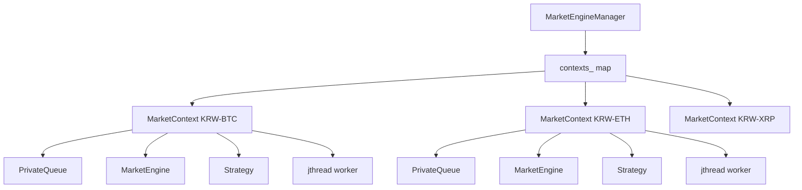

# MarketEngineManager.h

> **대상 파일**
> - `src/app/MarketEngineManager.h`

---

## 한눈에 보기

| 항목 | 내용 |
|------|------|
| **위치** | `src/app/` |
| **역할** | 멀티마켓 실행 오케스트레이터 (워커/엔진/전략/복구 조정) |
| **호출 시점** | 앱 시작 시 생성, `registerWith()` 후 `start()` |
| **핵심 입력** | `IOrderApi`, `OrderStore`, `AccountManager`, `markets` |
| **핵심 출력** | 마켓별 전략 판단과 엔진 주문 처리 루프 |
| **현재 정책** | 시작 시 계좌 동기화 + 마켓별 StartupRecovery + 최종 재동기화 |
| **인스턴스화** | 일반 클래스 인스턴스 필요 (`final`, 복사/이동 금지) |

---

## 1. 왜 이 파일이 필요한가

단일 마켓에서 엔진/전략 루프를 돌리는 것은 단순하지만, 멀티마켓에서는 다음 문제가 생긴다.

```
문제 1: 각 마켓 이벤트를 독립적으로 처리해야 함
         → 한 마켓 지연이 전체 마켓을 막으면 안 됨

문제 2: 계좌/주문 저장소는 공유 자원임
         → 마켓별 엔진은 분리하되, 공용 상태는 일관되게 유지해야 함

문제 3: 재시작/재연결 시 복구 타이밍이 복잡함
         → 시작 복구와 런타임 복구를 분리해 정책적으로 처리해야 함
```

`MarketEngineManager`는 위 문제를 해결하기 위해,
마켓별 `MarketContext`를 만들고 워커 스레드를 분리해 전체 실행을 조율한다.

---

## 2. 전체 구조



핵심은 "마켓별 실행은 분리, 계좌/주문 저장은 공유"다.

---

## 3. 생명주기

```cpp
MarketEngineManager(...)
  ├─ rebuildAccountOnStartup_(true)      // 1차 계좌 동기화 (실패 시 예외)
  ├─ 마켓별 Context 생성
  ├─ recoverMarketState_(ctx)            // StartupRecovery
  └─ rebuildAccountOnStartup_(false)     // 2차 최종 동기화 (실패 시 경고)

registerWith(router)                     // 마켓 큐를 EventRouter에 등록
start()                                  // 마켓별 워커 스레드 시작
stop()                                   // stop 요청 + join
~MarketEngineManager()                   // 소멸자에서 stop() 보장
```

> [!important] 사용 순서
> `registerWith()`를 `start()` 전에 호출해야 한다.
> 등록이 누락되면 이벤트가 각 마켓 큐로 라우팅되지 않는다.

---

## 4. 핵심 타입: `MarketManagerConfig`

```cpp
struct MarketManagerConfig {
    RsiMeanReversionStrategy::Params strategy_params;
    std::size_t queue_capacity = 5000;      // 마켓별 큐 최대 크기 (drop-oldest)
    int sync_retry = 3;                     // 초기 계좌 동기화 재시도 횟수
    std::chrono::seconds pending_timeout{120}; // Pending 상태 타임아웃 (2분)
};
```

- `queue_capacity`: 마켓별 이벤트 큐 상한
- `sync_retry`: 시작 시 계좌 조회 재시도 횟수
- `pending_timeout`: 주문 pending 장기화 감시 기준

---

## 5. 핵심 타입: `MarketContext`

`MarketContext`는 "마켓 1개 실행 단위"를 캡슐화한다.

| 멤버 | 목적 |
|------|------|
| `market` | 마켓 식별자 (`KRW-BTC`) |
| `engine` | 주문/체결 상태머신 |
| `strategy` | 신호 판단 로직 |
| `event_queue` | 해당 마켓 입력 이벤트 큐 |
| `worker` | 마켓 전용 `std::jthread` |
| `pending_candle` | 분봉 확정 지연 버퍼 |
| `tracking_pending` 계열 | pending 타임아웃 추적 상태 |
| `recovery_requested` | 재연결 복구 플래그(atomic) |

```cpp
struct MarketContext {
    std::string market;

    std::unique_ptr<engine::MarketEngine> engine;
    std::unique_ptr<trading::strategies::RsiMeanReversionStrategy> strategy;
    PrivateQueue event_queue;

    std::jthread worker;    // stop_token 내장 (C++20)

    // 같은 분봉의 중간 업데이트를 최신값으로 유지하고,
    // 다음 분봉이 들어오면 이전 분봉(최종 close)을 확정 처리한다.
    std::optional<core::Candle> pending_candle;

    // Pending 타임아웃 추적 상태
    bool tracking_pending{false};
    std::chrono::steady_clock::time_point pending_entered_at{};
    bool pending_timeout_fired{false};

    // 재연결 복구 플래그 (WS 스레드에서도 안전하게 set 가능)
    std::atomic<bool> recovery_requested{false};

    explicit MarketContext(std::string m, std::size_t queue_capacity)
        : market(std::move(m))
        , event_queue(queue_capacity)
    {}
};
```

이 구조로 마켓 간 실행 충돌을 최소화한다.

---

## 6. 공개 메서드 역할

### `registerWith(EventRouter&)`

- 각 `MarketContext.event_queue`를 라우터에 등록한다.
- 이벤트 분배 경로를 연결하는 초기화 단계다.

### `start()`

- 마켓별 워커 스레드를 시작한다.
- 각 워커는 `workerLoop_()`를 반복 실행한다.

### `stop()`

- 모든 워커에 `request_stop()`
- join 가능한 스레드를 모두 join
- 안전 종료를 보장한다.

### `requestReconnectRecovery()`

- 모든 마켓의 `recovery_requested`를 `true`로 설정
- 큐 적체와 무관하게 워커 루프 시작 지점에서 복구를 우선 처리한다.

---

## 7. private 메서드 설계 의도

| 메서드 | 의도 |
|------|------|
| `rebuildAccountOnStartup_` | 시작 시점 전용 전체 계좌 재구축 |
| `recoverMarketState_` | StartupRecovery로 미체결/포지션 초기 정렬 |
| `workerLoop_` | 워커 메인 루프 |
| `handleOne_` | 입력 variant 디스패치 |
| `handleMyOrder_` | myOrder 이벤트를 엔진 상태로 반영 |
| `handleMarketData_` | 캔들 확정 후 전략 실행 + submit |
| `handleEngineEvents_` | 엔진 이벤트를 전략 이벤트로 전달 |
| `runRecovery_` | 런타임 주문 단건 조회 기반 복구 |
| `queryOrderWithRetry_` | getOrder 재시도 헬퍼 |
| `findOrderInOpenOrders_` | open 주문 목록 fallback 탐색 |
| `checkPendingTimeout_` | pending 장기화 자동 복구 트리거 |
| `buildAccountSnapshot_` | AccountManager 예산을 전략 스냅샷으로 변환 |

핵심 포인트는 "시작 복구"와 "런타임 복구"를 다른 경로로 분리한 점이다.

---

## 8. 멤버 참조/소유 관계

```cpp
// 공유 자원 — 참조(reference)로 보관, 수명은 외부에서 보장
api::upbit::IOrderApi& api_;
engine::OrderStore& store_;
trading::allocation::AccountManager& account_mgr_;

// 마켓별 실행 단위 — unique_ptr로 소유
std::unordered_map<std::string, std::unique_ptr<MarketContext>> contexts_;
```

- `api_`, `store_`, `account_mgr_`는 **참조(reference)** 로 보관된다.
  - `MarketEngineManager`는 소유자가 아니라 조정자다.
  - 수명은 외부에서 보장되어야 한다.
- `contexts_`는 `unique_ptr<MarketContext>`로 소유한다.
  - 생성자 완료 후 내용이 고정되며, 워커 루프에서 포인터만 참조한다.

---

## 9. 동시성 관점 요약

1. 마켓별 `jthread`로 처리 경로 분리
2. 복구 요청은 `atomic<bool>` 플래그로 병합
3. pending 타임아웃은 마켓별로 독립 감시
4. 시작/종료는 `started_` 플래그로 재진입 방지

이 설계는 "한 마켓 장애가 다른 마켓 워커를 직접 멈추지 않게" 하는 데 초점이 있다.

---

## 10. 실제 운용 시나리오

### 시나리오 A: 정상 시작

```text
생성자 진입
  -> 계좌 1차 동기화 성공
  -> KRW-BTC/ETH/XRP 컨텍스트 생성
  -> StartupRecovery 실행
  -> 계좌 2차 동기화
registerWith -> start
  -> 마켓별 워커 동작 시작
```

### 시나리오 B: WS 재연결 발생

```text
외부에서 requestReconnectRecovery() 호출
  -> 각 market recovery_requested=true
워커 루프 다음 턴 시작 시 runRecovery_ 우선 실행
  -> pending 주문 조회/정산 시도
```

### 시나리오 C: pending 주문 장기화

```text
checkPendingTimeout_에서 임계시간 초과 감지
  -> runRecovery_ 호출
  -> 정산 성공 시 pending 해제
  -> 실패 시 상태 유지 후 다음 복구 주기 재시도
```

---

## 11. 설계 평가

**장점:**
- 멀티마켓 실행 단위를 `MarketContext`로 명확히 분리했다.
- 시작 복구/런타임 복구 정책이 메서드 수준에서 분리되어 읽기 쉽다.
- `IOrderApi` 추상화 기반이라 테스트 주입이 용이하다.
- `std::jthread` + `stop_token`으로 종료 경로가 안전하다.

**보완 포인트:**

| 항목 | 현재 | 개선 방향 |
|------|------|----------|
| 시작 시 계좌 조회 횟수 | 2회(+StartupRecovery 내부 조회) | 계좌 조회 통합/캐시로 중복 최소화 |
| 전략 타입 결합도 | `RsiMeanReversionStrategy` 고정 | 전략 인터페이스 도입으로 일반화 |
| 상태 진단 | 로그 중심 | 운영용 메트릭/헬스 엔드포인트 추가 |

---

## 12. 결론

`MarketEngineManager.h`는 멀티마켓 트레이딩 런타임의 **중앙 조정 계층**이다.

```text
입력 라우팅(EventRouter)
  -> 마켓별 워커 루프
  -> 엔진/전략 연계
  -> 시작/재연결/타임아웃 복구
```

즉, 이 헤더는 "마켓별 독립 실행"과 "공유 자원 일관성"을 동시에 만족시키는
실행 구조의 계약(Contract)을 정의한다.
