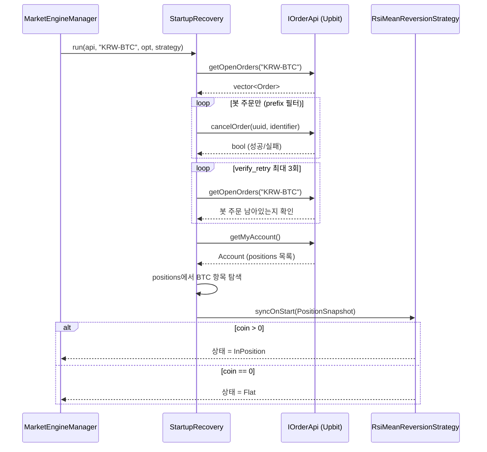

# StartupRecovery.h / .cpp

> **대상 파일**
> - `src/app/StartupRecovery.h`
> - `src/app/StartupRecovery.cpp`

---

## 한눈에 보기

| 항목 | 내용 |
|------|------|
| **위치** | `src/app/` |
| **역할** | 재시작 시 미체결 취소 + 포지션 복구 (일회성 유틸리티) |
| **호출 시점** | `MarketEngineManager` 생성자, 전략이 캔들을 받기 **이전** |
| **핵심 출력** | `PositionSnapshot` → `strategy.syncOnStart()` |
| **현재 정책** | 케이스 A: 미체결 전부 취소, 포지션만 복구 |
| **인스턴스화** | 모든 메서드가 `static` → 객체 생성 불필요 |

---

## 1. 왜 이 파일이 필요한가

봇은 언제든 예기치 않게 종료될 수 있다. 재시작 시 두 가지 문제가 발생한다.

```
문제 1: 이미 BTC를 보유 중인데 전략이 이를 모름
         → Flat 상태로 시작 → 중복 매수 발생

문제 2: 이전 세션에서 낸 봇 주문이 미체결로 남아 있음
         → 새 주문과 충돌 / 중복 주문 위험
```

StartupRecovery는 이 두 문제를 **재시작 직후 단 한 번** 해결한다.

> [!tip] 현재 정책 (케이스 A)
> 미체결 주문을 **이어받지 않고 전부 취소**한 뒤,
> 계좌 잔고에서 포지션만 읽어 전략 상태를 복구한다.
> 추후 케이스 B(기존 주문 복원)로 확장할 여지가 남아 있다.

---

## 2. 전체 실행 흐름



> [!important] 순서 불변 원칙
> **취소 먼저, 잔고 조회 나중**
> 취소 전에 계좌를 읽으면 "취소될 주문에 묶인 수량"이 `free`에 포함되어
> 포지션이 실제보다 작게 잡힐 수 있다.

---

## 3. Options 구조체 (`StartupRecovery.h`)

```cpp
struct Options {
    // 봇 주문임을 식별하는 문자열 prefix
    // 형식: "{strategy_id}:{market}:"
    // 예시: "rsi_mean_reversion:KRW-BTC:"
    std::string bot_identifier_prefix;

    int cancel_retry = 3;   // 단건 취소 최대 재시도 횟수
    int verify_retry = 3;   // 취소 완료 확인 최대 재시도 횟수
};
```

**실제 세팅 위치** (`MarketEngineManager.cpp`):
```cpp
StartupRecovery::Options opt;
// strategy->id() = "rsi_mean_reversion"
// ctx.market    = "KRW-BTC"
opt.bot_identifier_prefix = std::string(ctx.strategy->id()) + ":" + ctx.market + ":";
//  → "rsi_mean_reversion:KRW-BTC:"
```

> [!note] prefix가 핵심 안전 장치
> 이 prefix가 없으면 거래소 계정의 **모든** 미체결 주문이 취소 대상이 된다.
> 수동으로 넣어둔 주문, 다른 마켓 봇의 주문까지 날아갈 수 있다.
> prefix를 `strategy_id + market`으로 구성하면 마켓·전략 단위로 격리된다.

---

## 4. `run()` 템플릿 (`StartupRecovery.h`)

```cpp
// API 타입에 따라 두 가지 오버로드가 있지만 내부 순서는 동일
template <class StrategyT>
static void run(api::upbit::IOrderApi& api,
    std::string_view market,
    const Options& opt,
    StrategyT& strategy)
{
    cancelBotOpenOrders(api, market, opt);                              // ① 취소
    const trading::PositionSnapshot pos = buildPositionSnapshot(api, market); // ② 복구
    strategy.syncOnStart(pos);                                          // ③ 주입
}
```

> [!tip] 왜 StrategyT를 템플릿으로 받는가?
> `IStrategy` 같은 공통 인터페이스를 만들지 않아도 된다.
> 컴파일 타임에 `strategy.syncOnStart(pos)`가 있는지만 확인하면 되므로
> 전략 타입이 바뀌어도 이 함수는 수정할 필요가 없다. (Duck Typing)

**오버로드 구분 목적:**

| 오버로드 | API 타입 | 사용 상황 |
|----------|----------|----------|
| 1번 | `UpbitExchangeRestClient&` | 구버전 단일 마켓 호환 경로 |
| 2번 | `IOrderApi&` | `MarketEngineManager` (멀티마켓, 테스트 주입 가능) |

---

## 5. 유틸리티 함수들 (anonymous namespace, `StartupRecovery.cpp`)

> [!note] anonymous namespace란?
> `namespace { ... }` 안에 있는 함수는 이 `.cpp` 파일 내부에서만 사용 가능하다.
> 외부 링크(external linkage)가 없어서 다른 파일에서 실수로 호출할 수 없다.
> 헤더에 선언이 없는 "진짜 내부 구현"을 두는 C++ 관용 패턴.

### `startsWithImpl(s, prefix)`

```cpp
bool startsWithImpl(std::string_view s, std::string_view prefix) noexcept
{
    //  s가 prefix보다 짧으면 절대 prefix로 시작할 수 없다 → 단락평가로 비교 건너뜀
    return s.size() >= prefix.size()
        && s.substr(0, prefix.size()) == prefix;
    //     ↑ prefix 길이만큼 앞부분만 잘라서 비교
}
```

- `noexcept`: 예외를 던지지 않음을 보장 (string_view 연산은 safe)
- C++20의 `s.starts_with(prefix)`와 동일한 동작. 환경 호환을 위해 직접 구현.

### `unitCurrencyImpl` / `baseCurrencyImpl`

```
"KRW-BTC"
  │    │
  │    └─ base  (baseCurrencyImpl): "BTC"  → 거래 대상 코인
  └────── unit  (unitCurrencyImpl): "KRW"  → 결제 통화
```

```cpp
std::string_view unitCurrencyImpl(std::string_view market)
{
    const auto p = market.find('-');        // '-' 위치 찾기
    if (p == std::string_view::npos)        // '-' 없으면 잘못된 포맷
        return {};                          // 빈 string_view 반환 (호출자가 체크)
    return market.substr(0, p);             // 0 ~ '-' 직전 → "KRW"
}

std::string_view baseCurrencyImpl(std::string_view market)
{
    const auto p = market.find('-');
    if (p == std::string_view::npos)
        return {};
    return market.substr(p + 1);            // '-' 다음 ~ 끝 → "BTC"
}
```

> [!warning] string_view 수명 주의
> 반환된 `string_view`는 원본 `market` 문자열을 가리키는 포인터다.
> `market`이 소멸하면 반환값도 dangling pointer가 된다.
> 이 함수 내에서 `market`의 수명 안에서만 사용하기 때문에 안전하다.

---

## 6. `cancelBotOpenOrdersImpl` (`StartupRecovery.cpp`)

4단계로 동작한다.

### Step 1 — prefix 빈값 방어

```cpp
if (opt.bot_identifier_prefix.empty()) {
    // prefix가 없으면 "모든 주문"을 봇 주문으로 오해할 수 있다
    // → 경고만 출력하고 취소 전체를 건너뜀
    std::cout << "[Startup][Warn] bot_identifier_prefix is empty. skip cancel.\n";
    return;
}
```

### Step 2 — 미체결 주문 조회

```cpp
auto r = api.getOpenOrders(market);

// variant 분기: RestError면 실패
if (std::holds_alternative<api::rest::RestError>(r)) {
    const auto& e = std::get<api::rest::RestError>(r);
    std::cout << "[Startup][Warn] getOpenOrders failed: " << e.message << "\n";
    return; // 조회 자체 실패 → 취소 불가 → 안전하게 중단
}

// 성공이면 주문 목록 꺼냄 (move로 복사 비용 절감)
auto open = std::get<std::vector<core::Order>>(std::move(r));
```

> [!note] `std::variant`와 `holds_alternative`
> `getOpenOrders`는 성공/실패를 예외가 아닌 `variant<성공타입, 에러타입>`으로 반환한다.
> `holds_alternative<T>(v)`는 variant가 현재 T 타입을 들고 있는지 확인한다.
> `std::get<T>(v)`로 실제 값을 꺼낸다. 타입이 맞지 않으면 예외가 터지므로
> 반드시 `holds_alternative`로 먼저 확인 후 꺼내는 패턴을 쓴다.

### Step 3 — 봇 주문 필터 후 취소

```cpp
for (const auto& o : open)
{
    // ① identifier 없으면 봇 주문이 아닐 가능성이 높다 → 건너뜀
    if (!o.identifier.has_value())
        continue;

    // ② prefix 불일치 → 수동 주문 or 다른 봇 주문 → 건너뜀 (오취소 방지)
    if (!startsWithImpl(*o.identifier, opt.bot_identifier_prefix))
        continue;

    // uuid가 있으면 uuid로, 없으면 identifier로 취소 시도
    const std::optional<std::string> order_uuid =
        o.id.empty() ? std::nullopt : std::optional<std::string>(o.id);

    bool ok = false;
    for (int i = 0; i < opt.cancel_retry; ++i) // 최대 3회 재시도
    {
        auto cr = api.cancelOrder(order_uuid, o.identifier);
        if (std::holds_alternative<bool>(cr) && std::get<bool>(cr)) {
            ok = true;
            break; // 성공하면 재시도 중단
        }
        // 실패하면 다음 루프에서 재시도 (네트워크 일시 오류 대응)
    }

    // 결과 로그
    if (ok)
        std::cout << "[Startup] cancel ok: ...\n";
    else
        std::cout << "[Startup][Warn] cancel failed: ...\n";
}
```

**필터 조건 요약:**

```
미체결 주문 목록
    │
    ├─ identifier 없음?   → skip (봇 주문 아님)
    │
    ├─ prefix 불일치?     → skip (다른 전략/마켓/수동 주문)
    │
    └─ 해당 → cancelOrder() (최대 cancel_retry회)
```

### Step 4 — 취소 완료 검증

```cpp
for (int v = 0; v < opt.verify_retry; ++v)
{
    auto rr = api.getOpenOrders(market);
    if (std::holds_alternative<api::rest::RestError>(rr))
        break; // 조회 실패면 검증 포기

    const auto remain = std::get<std::vector<core::Order>>(std::move(rr));

    // 봇 주문이 하나라도 남아 있는지
    const bool anyBotRemain = std::any_of(remain.begin(), remain.end(),
        [&](const core::Order& o) {
            return o.identifier.has_value()
                && startsWithImpl(*o.identifier, opt.bot_identifier_prefix);
        });

    if (!anyBotRemain)
        break; // 깨끗하게 비워졌으면 검증 종료

    // 아직 남아 있으면 로그 후 재확인
    std::cout << "[Startup] bot open orders remain. re-check #" << (v + 1) << "\n";
}
```

> [!warning] 이 검증 루프의 한계
> `verify_retry` 사이에 `sleep`/backoff가 없다.
> Upbit 서버가 취소 요청을 처리하는 데 수백ms 지연이 있을 수 있는데,
> 곧바로 재조회하면 아직 반영 전인 상태를 보게 된다.
> 헤더 주석에도 "보완 포인트"로 명시되어 있다.

---

## 7. `buildPositionSnapshotImpl` (`StartupRecovery.cpp`)

### Step 1 — 계좌 조회

```cpp
trading::PositionSnapshot pos{}; // 기본값: coin=0, avg_entry_price=0

auto ar = api.getMyAccount();
if (std::holds_alternative<api::rest::RestError>(ar)) {
    std::cout << "[Startup][Warn] getMyAccount failed: ...\n";
    return pos; // 실패 → coin=0 그대로 반환 → 전략은 Flat으로 시작
}
const auto acc = std::get<core::Account>(std::move(ar));
```

> [!tip] 실패 시 예외 대신 "Flat으로 시작"
> 계좌 조회에 실패해도 봇을 강제 종료하지 않는다.
> `coin=0` 기본값으로 반환하면 전략이 Flat 상태로 시작해
> 새 신호가 올 때 정상적으로 진입을 시도한다.
> 잘못된 포지션 상태로 시작하는 것보다 안전한 보수적 정책이다.

### Step 2 — 마켓 파싱

```cpp
const std::string_view base = baseCurrencyImpl(market); // "KRW-BTC" → "BTC"
const std::string_view unit = unitCurrencyImpl(market); // "KRW-BTC" → "KRW"

if (base.empty() || unit.empty()) {
    std::cout << "[Startup][Warn] invalid market format: " << market << "\n";
    return pos; // 잘못된 포맷 → Flat으로 시작
}
```

### Step 3 — positions 탐색

```cpp
// acc.positions: 계좌가 보유한 모든 통화 목록
// 예) [{ currency="KRW", free=100000 },
//      { currency="BTC", unit_currency="KRW", free=0.005, avg_buy_price=85000000 }]

for (const auto& p : acc.positions)
{
    // "BTC"이고 결제 통화가 "KRW"인 항목만 선택
    if (p.currency == base && p.unit_currency == unit)
    {
        pos.coin = p.free;               // 주문에 묶이지 않은 가용 수량
        pos.avg_entry_price = p.avg_buy_price; // 업비트 제공 평균 매수가
        break;
    }
}
// 못 찾으면 pos.coin=0 그대로 → Flat 복구
```

> [!note] `p.free` vs `p.balance`
> `p.balance`는 전체 보유 수량, `p.free`는 주문에 묶이지 않은 가용 수량이다.
> Step 1에서 봇 미체결 주문을 전부 취소했기 때문에,
> 이 시점에서 `p.free ≈ p.balance`가 되어야 정상이다.
> `p.free`를 쓰는 것이 더 정확하다.

### Step 4 — 로그 후 반환

```cpp
std::cout << "[Startup] PositionSnapshot: coin=" << pos.coin
    << " avg_entry_price=" << pos.avg_entry_price
    << " (market=" << market << ")\n";
return pos;
```

---

## 8. 클래스 메서드 → anonymous namespace 위임 구조

헤더에는 `private` 메서드로 선언되고, `.cpp`에서 anonymous namespace 헬퍼에 위임한다.

```
[StartupRecovery.h]
  private:
    static void cancelBotOpenOrders(UpbitExchangeRestClient&, ...)
    static void cancelBotOpenOrders(IOrderApi&, ...)
    static PositionSnapshot buildPositionSnapshot(UpbitExchangeRestClient&, ...)
    static PositionSnapshot buildPositionSnapshot(IOrderApi&, ...)

         ↓ .cpp에서 전부 아래로 위임

[anonymous namespace in StartupRecovery.cpp]
    template<class ApiT>
    void cancelBotOpenOrdersImpl(ApiT&, ...)      ← 실제 로직 1개
    template<class ApiT>
    PositionSnapshot buildPositionSnapshotImpl(ApiT&, ...) ← 실제 로직 1개
```

**이 구조를 쓰는 이유:**

1. **로직 중복 제거**: `UpbitExchangeRestClient`와 `IOrderApi`가 같은 인터페이스(`getOpenOrders`, `cancelOrder`, `getMyAccount`)를 가지므로 템플릿 한 벌로 해결
2. **외부 노출 차단**: `private` 선언으로 외부 호출 막음, anonymous namespace로 링크 노출도 막음
3. **컴파일 타임 다형성**: 가상 함수(vtable) 없이 타입마다 최적화된 코드 생성

---

## 9. 전략 수신부 (`RsiMeanReversionStrategy::syncOnStart`)

StartupRecovery 입장에서 "전달하는 쪽"을 보았으니, "받는 쪽"도 확인한다.

```cpp
void RsiMeanReversionStrategy::syncOnStart(const trading::PositionSnapshot& pos)
{
    // 미체결 주문은 StartupRecovery에서 이미 전부 취소했음
    // → Pending 상태는 이어받지 않음

    if (pos.hasPosition()) {
        // coin > 0 → 보유 포지션 있음 → InPosition 상태로 복구
        state_ = State::InPosition;
        entry_price_ = pos.avg_entry_price;
        // ...
    } else {
        // coin == 0 → 보유 없음 → Flat 유지
        state_ = State::Flat;
    }
}
```

`PositionSnapshot.hasPosition()`:
```cpp
struct PositionSnapshot final {
    double coin{ 0.0 };
    double avg_entry_price{ 0.0 };

    [[nodiscard]] constexpr bool hasPosition() const noexcept {
        return coin > 0.0; // 단순히 coin 수량이 0보다 크면 포지션 있음
    }
};
```

---

## 10. 실제 시나리오 예시

### 시나리오 A: BTC 0.005개 보유 중 재시작

```
[계좌 잔고]
  KRW:  0원
  BTC:  free=0.005, avg_buy_price=85,000,000

[미체결 주문]
  없음 (이미 완전 체결됨)

→ cancelBotOpenOrders: 취소할 주문 없음
→ buildPositionSnapshot: pos.coin=0.005, pos.avg_entry_price=85,000,000
→ syncOnStart: 상태 = InPosition, entry_price=85,000,000
```

### 시나리오 B: 매수 주문 미체결 상태로 재시작

```
[계좌 잔고]
  KRW:  free=50,000원 (나머지 50,000원은 주문에 묶임)
  BTC:  없음

[미체결 주문]
  identifier="rsi_mean_reversion:KRW-BTC:buy-001"
  volume=0.001, price=50,000,000 상태

→ cancelBotOpenOrders:
    identifier가 prefix로 시작 → cancelOrder() 호출
    → KRW 50,000원 잠금 해제

→ buildPositionSnapshot:
    BTC 항목 없음 → pos.coin=0

→ syncOnStart: 상태 = Flat
   (미체결 매수가 취소됐으므로 새 신호에서 재진입 시도)
```

### 시나리오 C: 수동으로 넣은 주문이 있는 경우

```
[미체결 주문]
  A: identifier="rsi_mean_reversion:KRW-BTC:buy-001"  ← 봇 주문
  B: identifier=nullopt                                 ← 수동 주문 (identifier 없음)
  C: identifier="manual-order-001"                     ← 수동 주문 (prefix 불일치)

→ A만 취소 (prefix 일치)
→ B, C는 건너뜀 (수동 주문 보존)
```

---

## 11. 설계 평가

**장점:**
- 취소→조회→주입 순서가 `run()` 안에 고정되어 있어 호출자가 순서를 실수할 수 없다
- prefix + identifier 이중 필터로 수동 주문 오취소가 구조적으로 차단된다
- 실패 시 예외 대신 Flat 기본값으로 처리해 재시작 안정성을 확보한다
- 템플릿 헬퍼 한 벌로 두 API 타입을 중복 없이 지원한다

**보완 포인트:**

| 항목 | 현재 | 개선 방향 |
|------|------|----------|
| verify loop delay | sleep 없음 | verify 루프 사이 sleep(500ms) 추가 |
| 잔고 조회 타이밍 | 취소 직후 즉시 | 취소 후 잠시 대기 후 조회 |
| 취소 실패 카운트 | 로그만 있음 | 실패 횟수 반환/경고 레벨 상향 |
| 케이스 B | 미구현 | Options에 플래그 추가로 확장 가능 |

---

## 12. 결론

`StartupRecovery`는 재시작 안전성을 위한 **일회성 3단계 유틸리티**다.

```
① cancelBotOpenOrders  → prefix 필터로 봇 주문만 정확히 취소
② buildPositionSnapshot → 계좌 잔고에서 포지션 수량·평단 읽기
③ strategy.syncOnStart  → 전략을 InPosition / Flat으로 복구
```

이 순서와 필터가 있기 때문에, 재시작 후에도 전략이
"자신이 무엇을 보유하고 있는지"를 정확히 알고 동작할 수 있다.
